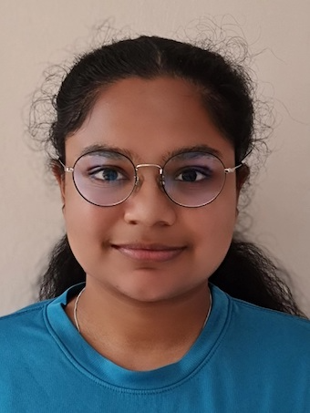

We are a team based in the [School of Computing, National University of Singapore](http://www.comp.nus.edu.sg).

You can reach us from our [GitHub Website](https://github.com/AY2324S1-CS2103T-F12-2/tp).

## Project team

### Pearlynn Toh

[[github](https://github.com/PearlynnT)]
[[portfolio](team/pearlynnt.md)]

* Role: Team Lead, Developer

### Yik Leong Loo

[[github](https://github.com/Bearypop)]
[[portfolio](team/bearypop.md)]

* Role: Developer
* Responsibilities: Testing + Integration

### Chan Wei Ning

[[github](https://github.com/wnchan)]
[[portfolio](team/wnchan.md)]

* Role: Developer
* Responsibilities: Documentation

### Alnaseri, Majedah Talal M

[[github](https://github.com/maj0-0)]
[[portfolio](team/maj0-0.md)]

* Role: Developer
* Responsibilities: Deliverables & Deadlines + Scheduling & Tracking

### Dewangan Neya Praveen

[[github](http://github.com/neyapraveen)]
[[portfolio](team/neyapraveen.md)]

* Role: Developer
* Responsibilities: Code Quality
