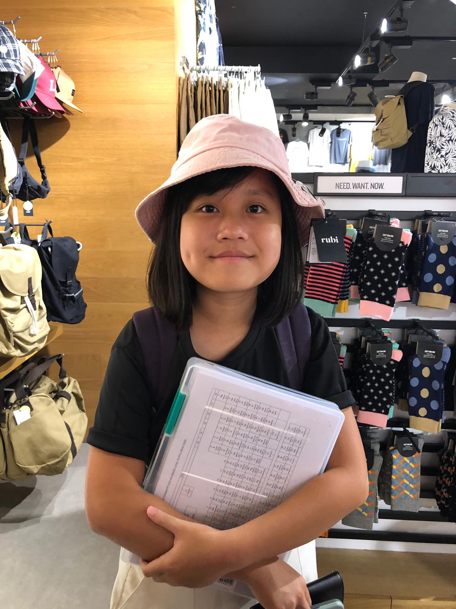
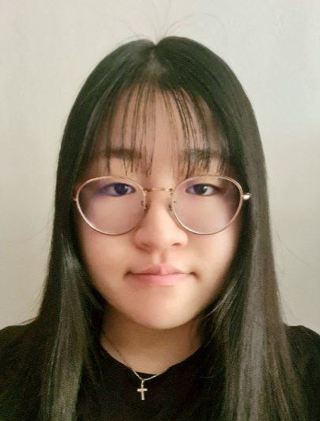

We are a team based in the [School of Computing, National University of Singapore](http://www.comp.nus.edu.sg).

You can reach us at the email `seer[at]comp.nus.edu.sg`

## Project team

### Pearlynn Toh

[[github](https://github.com/PearlynnT)]
[[portfolio](team/pearlynnt.md)]

* Role: Team Lead, Developer

### Yik Leong Loo

[[github](https://github.com/Bearypop)]
[[portfolio](team/bearypop.md)]

* Role: Developer
* Responsibilities: Testing + Integration

### Chan Wei Ning

[[github](https://github.com/wnchan)]
[[portfolio](team/wnchan.md)]

* Role: Developer
* Responsibilities: Documentation

### Johnny Doe

[[github](http://github.com/johndoe)] [[portfolio](team/johndoe.md)]

* Role: Developer
* Responsibilities: Data

### Majedah (Alnaseri, Majedah Talal M)

[[github](https://github.com/maj0-0)]
[[portfolio](team/maj0-0.md)]

* Role: Developer
* Responsibilities: Deliverables & Deadlines + Scheduling & Tracking

### James Doe

[[github](http://github.com/johndoe)]
[[portfolio](team/johndoe.md)]

* Role: Developer
* Responsibilities: UI
