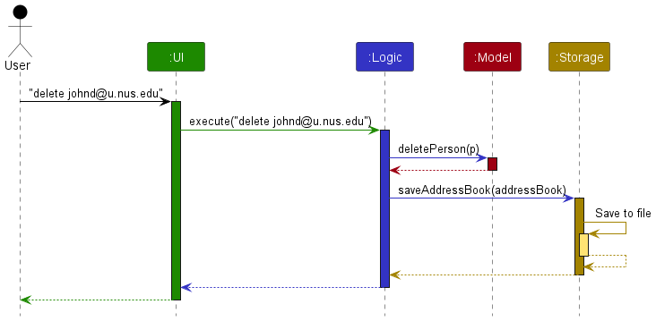
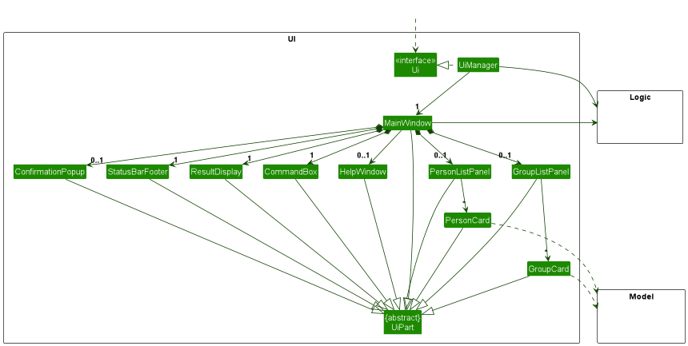

* Table of Contents
{:toc}

--------------------------------------------------------------------------------------------------------------------

## **Acknowledgements**

* {list here sources of all reused/adapted ideas, code, documentation, and third-party libraries -- include links to the original source as well}
* This project is based on the AddressBook-Level3 project created by the [SE-EDU initiative](https://se-education.org).

--------------------------------------------------------------------------------------------------------------------

## **Setting up, getting started**

Refer to the guide [_Setting up and getting started_](SettingUp.md).

--------------------------------------------------------------------------------------------------------------------

## **Design**

<div markdown="span" class="alert alert-primary">

:bulb: **Tip:** The `.puml` files used to create diagrams in this document `docs/diagrams` folder. Refer to the [_PlantUML Tutorial_ at se-edu/guides](https://se-education.org/guides/tutorials/plantUml.html) to learn how to create and edit diagrams.
</div>

### Architecture


The ***Architecture Diagram*** given above explains the high-level design of the App.

Given below is a quick overview of main components and how they interact with each other.

**Main components of the architecture**

**`Main`** (consisting of classes [`Main`](https://github.com/se-edu/addressbook-level3/tree/master/src/main/java/seedu/address/Main.java) and [`MainApp`](https://github.com/se-edu/addressbook-level3/tree/master/src/main/java/seedu/address/MainApp.java)) is in charge of the app launch and shut down.
* At app launch, it initializes the other components in the correct sequence, and connects them up with each other.
* At shut down, it shuts down the other components and invokes cleanup methods where necessary.

The bulk of the app's work is done by the following four components:

* [**`UI`**](#ui-component): The UI of the App.
* [**`Logic`**](#logic-component): The command executor.
* [**`Model`**](#model-component): Holds the data of the App in memory.
* [**`Storage`**](#storage-component): Reads data from, and writes data to, the hard disk.

[**`Commons`**](#common-classes) represents a collection of classes used by multiple other components.

**How the architecture components interact with each other**

The *Sequence Diagram* below shows how the components interact with each other for the scenario where the user issues the command `delete 1`.



Each of the four main components (also shown in the diagram above),

* defines its *API* in an `interface` with the same name as the Component.
* implements its functionality using a concrete `{Component Name}Manager` class (which follows the corresponding API `interface` mentioned in the previous point.

For example, the `Logic` component defines its API in the `Logic.java` interface and implements its functionality using the `LogicManager.java` class which follows the `Logic` interface. Other components interact with a given component through its interface rather than the concrete class (reason: to prevent outside component's being coupled to the implementation of a component), as illustrated in the (partial) class diagram below.


The sections below give more details of each component.

### UI component

The **API** of this component is specified in [`Ui.java`](https://github.com/se-edu/addressbook-level3/tree/master/src/main/java/seedu/address/ui/Ui.java)



The UI consists of a `MainWindow` that is made up of parts e.g.`CommandBox`, `ResultDisplay`, `PersonListPanel`, `StatusBarFooter` etc. All these, including the `MainWindow`, inherit from the abstract `UiPart` class which captures the commonalities between classes that represent parts of the visible GUI.

The `UI` component uses the JavaFx UI framework. The layout of these UI parts are defined in matching `.fxml` files that are in the `src/main/resources/view` folder. For example, the layout of the [`MainWindow`](https://github.com/se-edu/addressbook-level3/tree/master/src/main/java/seedu/address/ui/MainWindow.java) is specified in [`MainWindow.fxml`](https://github.com/se-edu/addressbook-level3/tree/master/src/main/resources/view/MainWindow.fxml)

The `UI` component,

* executes user commands using the `Logic` component.
* listens for changes to `Model` data so that the UI can be updated with the modified data.
* keeps a reference to the `Logic` component, because the `UI` relies on the `Logic` to execute commands.
* depends on some classes in the `Model` component, as it displays `Person` object residing in the `Model`.

### Logic component

**API** : [`Logic.java`](https://github.com/se-edu/addressbook-level3/tree/master/src/main/java/seedu/address/logic/Logic.java)

Here's a (partial) class diagram of the `Logic` component:


The sequence diagram below illustrates the interactions within the `Logic` component, taking `execute("delete 1")` API call as an example.


<div markdown="span" class="alert alert-info">:information_source: **Note:** The lifeline for `DeleteCommandParser` should end at the destroy marker (X) but due to a limitation of PlantUML, the lifeline reaches the end of diagram.
</div>

How the `Logic` component works:

1. When `Logic` is called upon to execute a command, it is passed to an `AddressBookParser` object which in turn creates a parser that matches the command (e.g., `DeleteCommandParser`) and uses it to parse the command.
1. This results in a `Command` object (more precisely, an object of one of its subclasses e.g., `DeleteCommand`) which is executed by the `LogicManager`.
1. The command can communicate with the `Model` when it is executed (e.g. to delete a person).
1. The result of the command execution is encapsulated as a `CommandResult` object which is returned back from `Logic`.

Here are the other classes in `Logic` (omitted from the class diagram above) that are used for parsing a user command:


How the parsing works:
* When called upon to parse a user command, the `AddressBookParser` class creates an `XYZCommandParser` (`XYZ` is a placeholder for the specific command name e.g., `AddCommandParser`) which uses the other classes shown above to parse the user command and create a `XYZCommand` object (e.g., `AddCommand`) which the `AddressBookParser` returns back as a `Command` object.
* All `XYZCommandParser` classes (e.g., `AddCommandParser`, `DeleteCommandParser`, ...) inherit from the `Parser` interface so that they can be treated similarly where possible e.g, during testing.

### Model component
**API** : [`Model.java`](https://github.com/se-edu/addressbook-level3/tree/master/src/main/java/seedu/address/model/Model.java)


The `Model` component,

* stores the address book data i.e., all `Person` objects (which are contained in a `UniquePersonList` object), and all `Group` objects (which are contained in a `UniqueGroupList` object).
* stores the currently 'selected' `Person` objects (e.g., results of a search query) as a separate _filtered_ list which is exposed to outsiders as an unmodifiable `ObservableList<Person>` that can be 'observed' e.g. the UI can be bound to this list so that the UI automatically updates when the data in the list change.
* stores the currently 'selected' `Group` objects (e.g., results of a search query) as a separate _filtered_ list which is exposed to outsiders as an unmodifiable `ObservableList<Group>` that can be 'observed' e.g. the UI can be bound to this list so that the UI automatically updates when the data in the list change.
* stores a `UserPref` object that represents the user’s preferences. This is exposed to the outside as a `ReadOnlyUserPref` objects.
* does not depend on any of the other three components (as the `Model` represents data entities of the domain, they should make sense on their own without depending on other components)

<div markdown="span" class="alert alert-info">:information_source: **Note:** An alternative (arguably, a more OOP) model is given below. It has a `Tag` list in the `AddressBook`, which `Person` references. This allows `AddressBook` to only require one `Tag` object per unique tag, instead of each `Person` needing their own `Tag` objects.<br>


</div>


### Storage component

**API** : [`Storage.java`](https://github.com/se-edu/addressbook-level3/tree/master/src/main/java/seedu/address/storage/Storage.java)


The `Storage` component,
* can save both address book data and user preference data in JSON format, and read them back into corresponding objects.
* inherits from both `AddressBookStorage` and `UserPrefStorage`, which means it can be treated as either one (if only the functionality of only one is needed).
* depends on some classes in the `Model` component (because the `Storage` component's job is to save/retrieve objects that belong to the `Model`)

### Common classes

Classes used by multiple components are in the `seedu.addressbook.commons` package.

--------------------------------------------------------------------------------------------------------------------

## **Implementation**

This section describes some noteworthy details on how certain features are implemented.


### Tutorial Field

#### Current Implementation

In response to the evolving needs of StudentConnect, we have introduced several essential enhancements to user profiles. These enhancements include the addition of fields for Tutorial, Nationality, and Gender. While Nationality and Tutorial have been successfully implemented, work on the Gender field is ongoing.

The Tutorial field is a crucial addition to the StudentConnect application, providing users with the capability to specify their tutorial groups, which are integral to their group formation needs. Here, we detail how the Tutorial field is implemented:

- **Data Structure**: Tutorials are now stored as a Set of Tutorial objects within the Person model. The use of a Set ensures that no duplicate tutorials can be associated with a single user. The code snippet below demonstrates this implementation:

  ```java
  Set<Tutorial> tutorials = new HashSet<Tutorial>();
  ```

- **Tutorial Attributes**: Each Tutorial object possesses an attribute called "value," which is of type string. The "value" must adhere to a two-digit format, ranging from 01 to 22.


- **Consistency**: The decision to enforce a two-digit format (e.g., T01, T02) was made for consistency, ensuring that all tutorials are consistently represented as "TXX," where XX corresponds to the tutorial group.


- **Range**: The allowed range of values, spanning from 01 to 22, aligns with the number of available tutorial group options for AY2023/2024 SEM1.


- **Set vs. List**: Initially, the tutorials field was implemented as a List of Tutorial objects (`List<Tutorial>`). However, we observed that this approach allowed for multiple duplicate tutorials to be input without triggering errors. To address this, we transitioned to using a Set of tutorials, which inherently disallows duplicate entries without the need for additional validation checks:

  ```java
  // Initial implementation as a List
  List<Tutorial> tutorials = new ArrayList<Tutorial>();
  ```

#### UML Diagrams

To provide a visual representation of the Tutorial field's implementation, we offer the following UML diagrams:

- **Class Diagram for Person**: This diagram illustrates the structure of the Person class, highlighting its relationship with the Tutorial field.


###  Create group feature

#### Implementation

The create group feature is implemented via the `CreateCommand` class and involves the following classes: `Group`, `UniqueGroupList`, `JsonAdaptedGroup`, `AddressBook`, `JsonSerializableAddressBook`.
<br>
`CreateCommand` implements the follwing operations:
* `CreateCommand#execute()` — Creates a new empty group using the group number generated from `generateGroupNumber`.
* `CreateCommand#generateGroupNumber()` — Generates the next available group number.

Given below is an example usage scenario and how the undo/redo mechanism behaves at each step.

Step 1. The user types in "create". The string, "create", is parsed by `AddressBookParser`, which returns a new instance of `CreateCommand`.
<br>
Step 2. The command is then executed by `CreateCommand#execute()`. `CreateCommand#execute()` calls `CreateCommand#generateGroupNumber()`.
<br>
Step 3. `CreateCommand#generateGroupNumber()` generates the next available group number, which is the next largest number that has not been assigned to a group. It loads in the current state of the Address Book via `AddressBook#getAddressBook`. It then iterates over the `Group` list inside the Address Book and checks the numbers of the groups to determine the next available group number.
<br>
Step 4. `CreateCommand#execute()` creates a new `Group` using the generated group number and adds it to the Address Book via `AddressBook#addGroup`.
<br>
Step 5. The `CommandResult` containing the success message is shown to the user.


### \[Proposed\] Undo/redo feature

#### Proposed Implementation

The proposed undo/redo mechanism is facilitated by `VersionedAddressBook`. It extends `AddressBook` with an undo/redo history, stored internally as an `addressBookStateList` and `currentStatePointer`. Additionally, it implements the following operations:

* `VersionedAddressBook#commit()` — Saves the current address book state in its history.
* `VersionedAddressBook#undo()` — Restores the previous address book state from its history.
* `VersionedAddressBook#redo()` — Restores a previously undone address book state from its history.

These operations are exposed in the `Model` interface as `Model#commitAddressBook()`, `Model#undoAddressBook()` and `Model#redoAddressBook()` respectively.

Given below is an example usage scenario and how the undo/redo mechanism behaves at each step.

Step 1. The user launches the application for the first time. The `VersionedAddressBook` will be initialized with the initial address book state, and the `currentStatePointer` pointing to that single address book state.


Step 2. The user executes `delete 5` command to delete the 5th person in the address book. The `delete` command calls `Model#commitAddressBook()`, causing the modified state of the address book after the `delete 5` command executes to be saved in the `addressBookStateList`, and the `currentStatePointer` is shifted to the newly inserted address book state.


Step 3. The user executes `add n/David …​` to add a new person. The `add` command also calls `Model#commitAddressBook()`, causing another modified address book state to be saved into the `addressBookStateList`.


<div markdown="span" class="alert alert-info">:information_source: **Note:** If a command fails its execution, it will not call `Model#commitAddressBook()`, so the address book state will not be saved into the `addressBookStateList`.

</div>

Step 4. The user now decides that adding the person was a mistake, and decides to undo that action by executing the `undo` command. The `undo` command will call `Model#undoAddressBook()`, which will shift the `currentStatePointer` once to the left, pointing it to the previous address book state, and restores the address book to that state.


<div markdown="span" class="alert alert-info">:information_source: **Note:** If the `currentStatePointer` is at index 0, pointing to the initial AddressBook state, then there are no previous AddressBook states to restore. The `undo` command uses `Model#canUndoAddressBook()` to check if this is the case. If so, it will return an error to the user rather
than attempting to perform the undo.

</div>

The following sequence diagram shows how the undo operation works:


<div markdown="span" class="alert alert-info">:information_source: **Note:** The lifeline for `UndoCommand` should end at the destroy marker (X) but due to a limitation of PlantUML, the lifeline reaches the end of diagram.

</div>

The `redo` command does the opposite — it calls `Model#redoAddressBook()`, which shifts the `currentStatePointer` once to the right, pointing to the previously undone state, and restores the address book to that state.

<div markdown="span" class="alert alert-info">:information_source: **Note:** If the `currentStatePointer` is at index `addressBookStateList.size() - 1`, pointing to the latest address book state, then there are no undone AddressBook states to restore. The `redo` command uses `Model#canRedoAddressBook()` to check if this is the case. If so, it will return an error to the user rather than attempting to perform the redo.

</div>

Step 5. The user then decides to execute the command `list`. Commands that do not modify the address book, such as `list`, will usually not call `Model#commitAddressBook()`, `Model#undoAddressBook()` or `Model#redoAddressBook()`. Thus, the `addressBookStateList` remains unchanged.


Step 6. The user executes `clear`, which calls `Model#commitAddressBook()`. Since the `currentStatePointer` is not pointing at the end of the `addressBookStateList`, all address book states after the `currentStatePointer` will be purged. Reason: It no longer makes sense to redo the `add n/David …​` command. This is the behavior that most modern desktop applications follow.


The following activity diagram summarizes what happens when a user executes a new command:


#### Design considerations:

**Aspect: How undo & redo executes:**

* **Alternative 1 (current choice):** Saves the entire address book.
  * Pros: Easy to implement.
  * Cons: May have performance issues in terms of memory usage.

* **Alternative 2:** Individual command knows how to undo/redo by
  itself.
  * Pros: Will use less memory (e.g. for `delete`, just save the person being deleted).
  * Cons: We must ensure that the implementation of each individual command are correct.

_{more aspects and alternatives to be added}_

### \[Proposed\] Data archiving

_{Explain here how the data archiving feature will be implemented}_


--------------------------------------------------------------------------------------------------------------------

## **Documentation, logging, testing, configuration, dev-ops**

* [Documentation guide](Documentation.md)
* [Testing guide](Testing.md)
* [Logging guide](Logging.md)
* [Configuration guide](Configuration.md)
* [DevOps guide](DevOps.md)

--------------------------------------------------------------------------------------------------------------------

## **Appendix: Requirements**

### Product scope

**Target user profile**:

* CS2103T student
* Face challenges in finding like-minded students for group projects
* Busy academic schedule
* Need assistance in keeping track of project deadlines, tasks, and progress
* Can type fast
* Prefer desktop apps over other types
* Prefers typing to mouse interactions


**Value proposition**: StudentConnect stores and organises students’ contact details, and project group.
Students can easily search for the profiles of other students and connect with potential teammates.
This streamlines the process of forming project teams. It also offers tools for tracking project
progress/deadlines, ensuring that the group stays on task. There is no other application quite like StudentConnect for
CS2103T students.


### User stories

Priorities: High (must have) - `* * *`, Medium (nice to have) - `* *`, Low (unlikely to have) - `*`


| Priority | As a …​            | I want to …​                                                  | So that I can…​                                   |
|----------|--------------------|---------------------------------------------------------------|---------------------------------------------------|
| `* * *`  | student            | add my personal details to the system                         | get other students to learn more about me         |
| `* * *`  | student            | view the rest of the students in the course                   | see my options for choosing teammates             |
| `* * *`  | student            | see the other student’s name, major, basic info etc           | make informed decisions                           |
| `* * *`  | student            | customise and update my profile details                       | ensure that my profile is up to date              |
| `* * *`  | student            | view other students in the same tutorial group                | communicate with them                             |
| `* * *`  | student            | remove my personal details from the system                    | stop using the application                        |
| `* * *`  | student            | join a group on the app                                       | form a group for the course                       |
| `* * *`  | user               | exit the app                                                  | close the app                                     |
| `* *`    | student            | seek help and check requirements for cs2101/cs2103t groupings | be more clear of the valid group formations       |
| `* * `   | student            | be able to click the links of the social media to view them   | avoid wasting time typing links manually          |
| `* * `   | student            | be able to leave a group on the app                           | join another group of my choice                   |
| `* * `   | student            | be able to delete a group I created on the app                | get rid of unnecessary groups on the system       |
| `* * *`  | course coordinator | be able to remove all the data from the system                | reuse the application for new batches of students |
| `* * *`  | course coordinator | be asked to confirm if I want to clear all the data           | prevent accidentally clearing all the data        |

*{More to be added}*

### Use cases

(For all use cases below, the System is `StudentConnect` and the Actor is the `student`, unless specified otherwise)

**Use case: List students**

**MSS**

1.  Student requests to list students.
2.  StudentConnect shows a list of students.

    Use case ends.

**Extensions**

* 2a. The list is empty.

  Use case ends.

**Use case: Adding a student**

**MSS**

1. Student requests to add their personal information.
2. StudentConnect adds the student’s information into the list.

    Use case ends.

**Extensions**

* 2a. Input is invalid.
    * StudentConnect displays error message.

  Use case ends.

**Use Case: Find a student**

**MSS**

1. Student requests to find students by name with keyword(s).
2. StudentConnect shows a list of students whose name(s) contain the keyword(s).

    Use case ends.

**Extensions:**

* 2a. The given keyword(s) does not match any of the students’ names.

    Use case ends.

**Use Case: Filter students**

**MSS**

1. Student requests to filter students by tutorial slot.
2. StudentConnect shows a list of students whose tutorial(s) contain the given slot.

    Use case ends.

* 2a. The given slot(s) does not match any of the students' tutorial slots.

    Use case ends.

**Use Case: Delete a student**

**MSS**

1. Student requests to delete a specific student on the list by email.
2. StudentConnect deletes the student.

   Use case ends.

**Extensions:**

* 1a. The given email is invalid.
    * 1a1. StudentConnect shows an error message.

  Use case ends.

**Use Case: Edit a student**

**MSS**

1. Student requests to update a specific student’s details on the list by email.
2. StudentConnect shows a list of students containing the student with the updated details.

   Use case ends.

**Extensions:**

* 1a. The given email is invalid.
    * 1a1. StudentConnect shows an error message.

   Use case ends.

**Use Case: Create a group**

**MSS**

1. Student requests to create a group by typing “create”.
2. StudentConnect creates a new empty group.

   Use case ends.

**Use Case: Access social media**

**MSS**

1. Student requests to list students.
2. Student clicks on social media link of a person.
3. Student connect opens the social media link in the browser.

   Use case ends.

**Extensions:**

* 1a. Student requests to find a student instead.
    * Use case resumes from step 2.

* 4a. The website linked does not exist.
  * 4a1. Browser shows that corresponding link does not exist.

    Use case ends.

* 4b. Hyperlink does not exist
  * 4b1. StudentConnect does not redirect to the browser.
    
    Use case ends.

**Use Case: Exit the app**

**MSS**

1. Student requests to delete the app by typing “exit”.
2. StudentConnect displays the goodbye message.
3. StudentConnect closes.

   Use case ends.

**Use case: Clearing all data**

**MSS**

1. User requests to clear data.
2. StudentConnect shows a pop-up asking for confirmation.
3. User confirms.
4. StudentConnect clears all data from the system.

    Use case ends.

**Extensions**

* 3a. User cancels clearing the data.
  * 3a1. StudentConnect cancels the process and returns to main window.

    Use case ends.
* 3a. User does not respond.

    Use case ends.


**Use Case: Checking valid group formations**

**MSS**

1. Student requests to see requirement list by typing “help”.
2. StudentConnect displays the help message, along with the requirement message.

   Use case ends.

**Use Case: Delete a group**

**MSS**

1. Student requests to delete a specific group.
2. StudentConnect deletes the particular group.

   Use case ends.

**Extensions:**

* 1a. The specified group does not exist. 
  * 1a1. StudentConnect states the corresponding group does not exist.

      Use case ends.

**Use Case: Find a group**

**MSS**

1. Student requests to find groups by group number with keyword(s).
2. StudentConnect shows a list of group(s) with group number(s) matching the keyword(s).

    Use case ends.

**Extensions:**
* 2a. The given keyword(s) does not match any of the group numbers.

    Use case ends.

**Use Case: Filter groups**

**MSS**

1. Student requests to filter groups by tutorial slot.
2. StudentConnect shows a list of groups that belong to the given tutorial slot.

    Use case ends.

**Extensions:**
* 2a. The given slot does not match any of the groups' tutorial slot.

    Use case ends.

**Use Case: Leave a group**

**MSS**

1. Student requests to leave a specific group.
2. StudentConnect removes their details from the particular group.

   Use case ends.

**Extensions:**

* 1a. The specified group does not exist. 
  * 1a1. StudentConnect states the corresponding group does not exist.

    Use case ends.

* 1b. The student is not in the specified group.
  * 1b1. StudentConnect notifies the student that they are not in the group.

    Use case ends.


**Use Case: Mark Task as Done**

**MSS**

1. Student requests to mark a task of a group as done.
2. Student provides the group number and task index.
3. StudentConnect marks the specified task as done.
4. StudentConnect displays a success message.

   Use case ends.

**Extensions:**

* 4a. The specified group does not exist.
    * 4a1. StudentConnect shows an error message: "Group with the provided group number not found."
    * Use case ends.

* 4b. The specified task index is invalid.
    * 4b1. StudentConnect shows an error message: "Invalid task index. Task not found."
    * Use case ends.

**Use Case: Mark Task as Not Done**

**MSS**

1. Student requests to unmark a task that was marked as done.
2. Student provides the group number and task index.
3. StudentConnect marks the specified task as not done.
4. StudentConnect displays a success message.

    Use case ends.

**Extensions:**

* 4a. The specified group does not exist.
    * 4a1. StudentConnect shows an error message: "Group with the provided group number not found."
    * Use case ends.

* 4b. The specified task index is invalid.
    * 4b1. StudentConnect shows an error message: "Invalid task index. Task not found."
    * Use case ends.

*{More to be added}*

### Non-Functional Requirements

1. Should work on any mainstream OS as long as it has Java `11` or above installed.
2. Should be able to hold up to 1000 persons without a noticeable sluggishness in performance for typical usage.
3. A student with above average typing speed for regular English text (i.e. not code, not system admin commands) should be able to accomplish most of the tasks faster using commands than using the mouse.

*{More to be added}*

### Glossary

* **Mainstream OS**: Windows, Linux, Unix, OS-X
* **CS2103T**: NUS Software Engineering Course

--------------------------------------------------------------------------------------------------------------------

## **Appendix: Instructions for manual testing**

Given below are instructions to test the app manually.

<div markdown="span" class="alert alert-info">:information_source: **Note:** These instructions only provide a starting point for testers to work on;
testers are expected to do more *exploratory* testing.

</div>

### Launch and shutdown

1. Initial launch

   1. Download the jar file and copy into an empty folder

   1. Double-click the jar file Expected: Shows the GUI with a set of sample contacts. The window size may not be optimum.

1. Saving window preferences

   1. Resize the window to an optimum size. Move the window to a different location. Close the window.

   1. Re-launch the app by double-clicking the jar file.<br>
       Expected: The most recent window size and location is retained.

1. _{ more test cases …​ }_

### Deleting a person

1. Deleting a person while all persons are being shown

   1. Prerequisites: List all persons using the `list` command. Multiple persons in the list.

   1. Test case: `delete alexy@u.nus.edu`<br>
      Expected: Contact with above email deleted from the list. Details of the deleted contact shown in the status message. Timestamp in the status bar is updated.

   1. Test case: `delete 0`<br>
      Expected: No person is deleted. Error details shown in the status message. Status bar remains the same.

   1. Other incorrect delete commands to try: `delete`, `delete abc@gmail.com`, `delete 1`<br>
      Expected: Similar to previous.

1. _{ more test cases …​ }_

### Saving data

1. Dealing with missing/corrupted data files

   1. _{explain how to simulate a missing/corrupted file, and the expected behavior}_

1. _{ more test cases …​ }_
