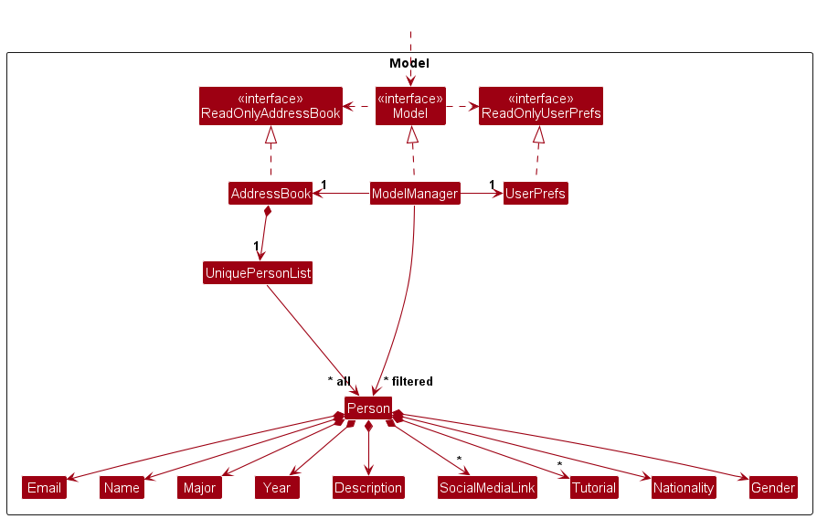
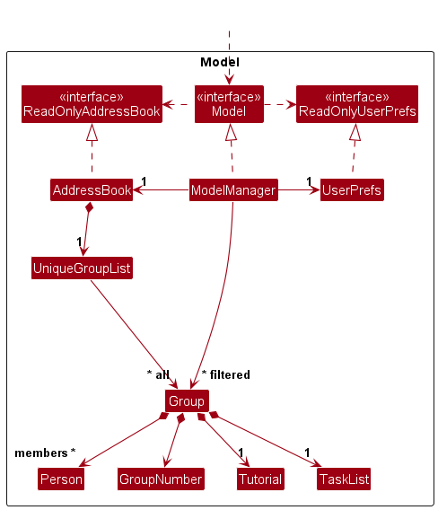
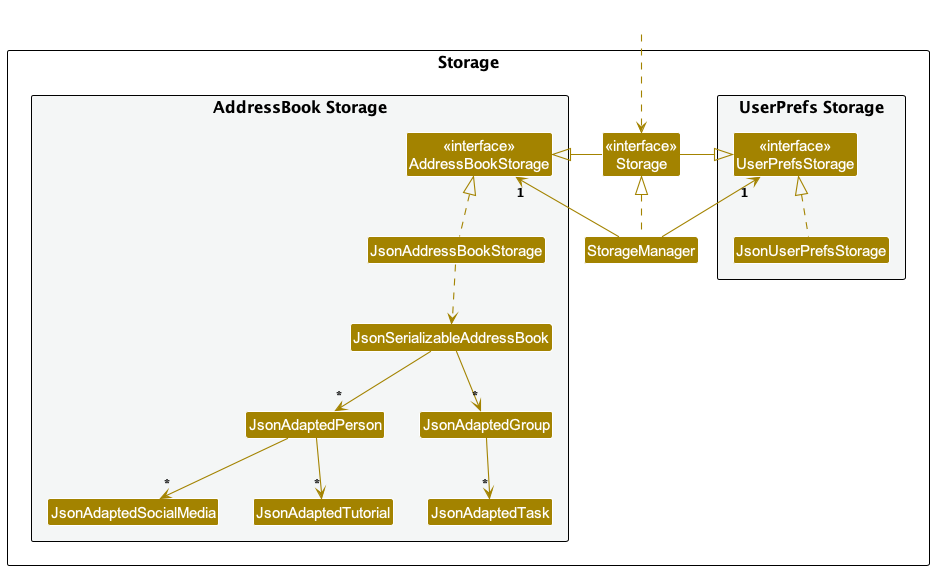
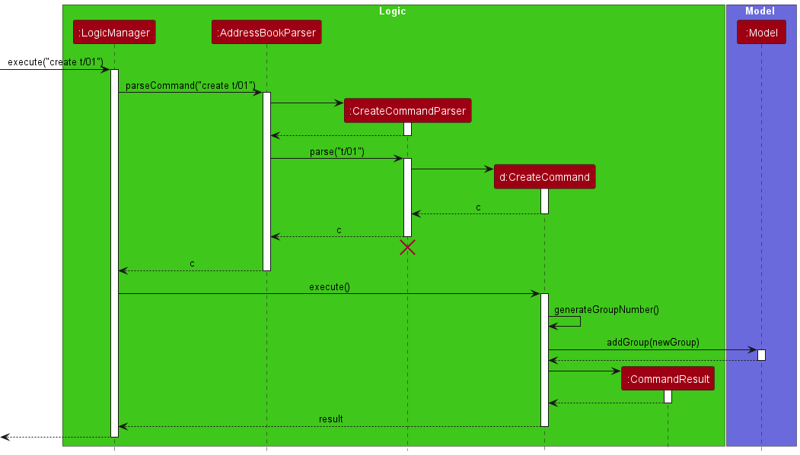

* Table of Contents
{:toc}

--------------------------------------------------------------------------------------------------------------------

## **Acknowledgements**

* {list here sources of all reused/adapted ideas, code, documentation, and third-party libraries -- include links to the original source as well}
* This project is based on the AddressBook-Level3 project created by the [**SE-EDU initiative**](https://se-education.org).

--------------------------------------------------------------------------------------------------------------------

## **Setting up, getting started**

Refer to the guide [**_Setting up and getting started_**](SettingUp.md).

--------------------------------------------------------------------------------------------------------------------

## **Design**

<div markdown="span" class="alert alert-primary">

:bulb: **Tip:** The `.puml` files used to create diagrams in this document `docs/diagrams` folder. Refer to the 
[_PlantUML Tutorial_ at se-edu/guides](https://se-education.org/guides/tutorials/plantUml.html) to learn how to create and edit diagrams.
</div>

### Architecture


The ***Architecture Diagram*** given above explains the high-level design of the app.

Given below is a quick overview of main components and how they interact with each other.

**Main components of the architecture**

**`Main`** (consisting of classes [`Main`](https://github.com/se-edu/addressbook-level3/tree/master/src/main/java/seedu/address/Main.java) 
and [`MainApp`](https://github.com/se-edu/addressbook-level3/tree/master/src/main/java/seedu/address/MainApp.java)) is in charge of the app launch and shut down.
* At app launch, it initialises the other components in the correct sequence, and connects them up with each other.
* At shut down, it shuts down the other components and invokes cleanup methods where necessary.

The bulk of the app's work is done by the following four components:

* [**`UI`**](#ui-component): The UI of the app.
* [**`Logic`**](#logic-component): The command executor.
* [**`Model`**](#model-component): Holds the data of the app in memory.
* [**`Storage`**](#storage-component): Reads data from, and writes data to, the hard disk.

[**`Commons`**](#common-classes) represents a collection of classes used by multiple other components.

**How the architecture components interact with each other**

The *Sequence Diagram* below shows how the components interact with each other for the scenario where the user issues the command `delete johnd@u.nus.edu`.


Each of the four main components (also shown in the diagram above),

* defines its *API* in an `interface` with the same name as the Component.
* implements its functionality using a concrete `{Component Name}Manager` class (which follows the corresponding API `interface` mentioned in the previous point).

For example, the `Logic` component defines its API in the `Logic.java` interface and implements its functionality using the 
`LogicManager.java` class which follows the `Logic` interface. Other components interact with a given component through its interface 
rather than the concrete class (reason: to prevent outside component's being coupled to the implementation of a component), as illustrated in the (partial) class diagram below.


The sections below give more details of each component.

### UI component

The **API** of this component is specified in [`Ui.java`](https://github.com/se-edu/addressbook-level3/tree/master/src/main/java/seedu/address/ui/Ui.java)


The UI consists of a `MainWindow` that is made up of different parts e.g., `CommandBox`, `ResultDisplay`, `PersonListPanel`, 
`StatusBarFooter`, `ConfirmationPopup` etc. All these, including the `MainWindow`, inherit from the abstract `UiPart` class which 
captures the commonalities between classes that represent parts of the visible GUI.

The `UI` component uses the JavaFx UI framework. The layout of these UI parts are defined in matching `.fxml` files that are 
in the `src/main/resources/view` folder. For example, the layout of the 
[`MainWindow`](https://github.com/AY2324S1-CS2103T-F12-2/tp/blob/master/src/main/java/seedu/address/ui/MainWindow.java) is 
specified in [`MainWindow.fxml`](https://github.com/AY2324S1-CS2103T-F12-2/tp/blob/master/src/main/resources/view/MainWindow.fxml)

The `UI` component,

* executes user commands using the `Logic` component.
* listens for changes to `Model` data so that the UI can be updated with the modified data.
* keeps a reference to the `Logic` component, because the `UI` relies on the `Logic` to execute commands.
* depends on some classes in the `Model` component, as it displays `Person` or `Group` object residing in the `Model`.

### Logic component

**API** : [`Logic.java`](https://github.com/se-edu/addressbook-level3/tree/master/src/main/java/seedu/address/logic/Logic.java)

Here's a (partial) class diagram of the `Logic` component:


The sequence diagram below illustrates the interactions within the `Logic` component, taking `execute("delete johnd@u.nus.edu")` API call as an example.


<div markdown="span" class="alert alert-info">:information_source: **Note:** The lifeline for `DeleteCommandParser` 
should end at the destroy marker (X) but due to a limitation of PlantUML, the lifeline reaches the end of diagram.
</div>

How the `Logic` component works:

1. When `Logic` is called upon to execute a command, it is passed to an `AddressBookParser` object which in turn creates 
a parser that matches the command (e.g., `DeleteCommandParser`) and uses it to parse the command.
2. This results in a `Command` object (more precisely, an object of one of its subclasses e.g., `DeleteCommand`) which is executed by the `LogicManager`.
3. The command can communicate with the `Model` when it is executed (e.g., to delete a person).
4. The result of the command execution is encapsulated as a `CommandResult` object which is returned back from `Logic`.

Here are the other classes in `Logic` (omitted from the class diagram above) that are used for parsing a user command:


How the parsing works:
* When called upon to parse a user command, the `AddressBookParser` class creates an `XYZCommandParser` (`XYZ` is a 
placeholder for the specific command name e.g., `AddCommandParser`) which uses the other classes shown above to parse 
the user command and create a `XYZCommand` object (e.g., `AddCommand`) which the `AddressBookParser` returns back as a `Command` object.
* All `XYZCommandParser` classes (e.g., `AddCommandParser`, `DeleteCommandParser`, ...) inherit from the `Parser` interface 
so that they can be treated similarly where possible e.g, during testing.

### Model component
**API** : [`Model.java`](https://github.com/se-edu/addressbook-level3/tree/master/src/main/java/seedu/address/model/Model.java)
<div style="text-align: center; border: 1px solid #000; padding: 10px; display: inline-block; margin: auto;">
  
  <div>Person Model Class Diagram</div>
</div>

<div style="text-align: center; border: 1px solid #000; padding: 10px; display: inline-block; margin-bottom: 10px;">
  
  <div>Group Model Class Diagram</div>
</div>

The `Model` component,

* stores the address book data i.e., all `Person` objects (which are contained in a `UniquePersonList` object), and all 
`Group` objects (which are contained in a `UniqueGroupList` object).
* stores the currently 'selected' `Person` objects (e.g., results of a search query) as a separate _filtered_ list which 
is exposed to outsiders as an unmodifiable `ObservableList<Person>` that can be 'observed' e.g., the UI can be bound to 
this list so that the UI automatically updates when the data in the list change.
* stores the currently 'selected' `Group` objects (e.g., results of a search query) as a separate _filtered_ list which 
is exposed to outsiders as an unmodifiable `ObservableList<Group>` that can be 'observed' e.g., the UI can be bound to this 
list so that the UI automatically updates when the data in the list change.
* stores a `UserPref` object that represents the user’s preferences. This is exposed to the outside as a `ReadOnlyUserPref` objects.
* does not depend on any of the other three components (as the `Model` represents data entities of the domain, 
they should make sense on their own without depending on other components)


### Storage component

**API** : [`Storage.java`](https://github.com/se-edu/addressbook-level3/tree/master/src/main/java/seedu/address/storage/Storage.java)



The `Storage` component,
* can save both address book data and user preference data in JSON format, and read them back into corresponding objects.
* inherits from both `AddressBookStorage` and `UserPrefStorage`, which means it can be treated as either one (if only the functionality of only one is needed).
* depends on some classes in the `Model` component (because the `Storage` component's job is to save/retrieve objects that belong to the `Model`)

### Common classes

Classes used by multiple components are in the `seedu.addressbook.commons` package.

--------------------------------------------------------------------------------------------------------------------

## **Implementation**

This section describes some noteworthy details on how certain features are implemented.

---

### Tutorial Field

#### Current Implementation

In response to the evolving needs of StudentConnect, we have introduced several essential enhancements to user profiles. These enhancements include the addition of fields for Tutorial, Nationality, and Gender.

The Tutorial field is a crucial addition to the StudentConnect application, providing users with the capability to specify their tutorial groups, which are integral to their group formation needs. Here, we detail how the Tutorial field is implemented:

- **Data Structure**: Tutorials are now stored as a Set of Tutorial objects within the Person model. The use of a Set ensures that no duplicate tutorials can be associated with a single user. The code snippet below demonstrates this implementation:

  ```java
  Set<Tutorial> tutorials = new HashSet<Tutorial>();
  ```

- **Tutorial Attributes**: Each Tutorial object possesses an attribute called "value," which is of type string. The "value" must adhere to a two-digit format, ranging from 01 to 22.


- **Consistency**: The decision to enforce a two-digit format (e.g., T01, T02) was made for consistency, ensuring that all tutorials are consistently represented as "TXX," where XX corresponds to the tutorial group.


- **Range**: The allowed range of values, spanning from 01 to 22, aligns with the number of available tutorial group options for AY2023/2024 SEM1.


- **Set vs. List**: Initially, the tutorials field was implemented as a List of Tutorial objects (`List<Tutorial>`). However, we observed that this approach allowed for multiple duplicate tutorials to be input without triggering errors. To address this, we transitioned to using a Set of tutorials, which inherently disallows duplicate entries without the need for additional validation checks:

  ```java
  // Initial implementation as a List
  List<Tutorial> tutorials = new ArrayList<Tutorial>();
  ```

---

### List Tasks Feature

#### Current Implementation

The list tasks feature is facilitated by the `TasksCommand` class and involves the cooperation of several other classes including `Group`, `TaskList`, and `Model`. This command is designed to list all tasks associated with a specific group in StudentConnect, which is particularly useful for managing tasks in courses like CS2103T and CS2101.

The process is initiated when the user inputs a command to list tasks associated with a group. Here's the breakdown of the steps and class interactions:

1. **Input Parsing**: The user's input is first parsed by `AddressBookParser`, which identifies the command word and delegates the argument parsing to `TasksCommandParser`.

2. **Command Creation**: `TasksCommandParser` parses the provided arguments, checks for correctness, and if valid, constructs a `TasksCommand` object with the specified group number.

3. **Command Execution**: `TasksCommand#execute()` is then called. It retrieves the specified group by number using `Model#getGroupWithNumber()`. If the group exists, it then retrieves the group's tasks using `Group#getTasks()`.

4. **Task Initialisation**: If no tasks are currently set, `TasksCommand` initialises a default set of tasks through `TaskInitializer.initializeTasks()` to ensure that each group has tasks pre-set, reflecting the course's structure.

5. **Result Generation**: Finally, the tasks are converted to a String format and included in the `CommandResult` which then displays the tasks in the feedback panel.

The `TasksCommand` class performs the following operations:
- `TasksCommand#execute()` - Lists all tasks for the specified group number.
- `TasksCommand#equals()` - Compares this `TasksCommand` with another command for equality, based on the group number.

The feature's utility is highlighted by its ability to list pre-set tasks automatically assigned to each group, reflecting the tasks specific to CS2103T and CS2101 courses.

#### Proposed Future Implementation

The future enhancements for the Tasks Command aim to significantly improve user interaction and task management within the application. The proposed improvements will enable users to not only list tasks but also add, edit, and delete tasks as per their requirements. This will provide users with full control over how they manage the task workflow for each group, making the application more flexible and user-friendly.

Additionally, we plan to develop a dedicated panel within the User Interface (UI) specifically for tasks. This dedicated task panel will allow users to view all tasks in a separate, focused area of the UI, making task management more organized and less cluttered. With a dedicated panel, the tasks will not only be more visible but can also be interacted with in a more intuitive way. Users will be able to see at a glance all the tasks for a group, check their completion status, and access task details with a single click.

---

###  Create group feature

#### Implementation

The create group feature is implemented via the `CreateCommand` class and involves the following classes: `Group`, `UniqueGroupList`, `JsonAdaptedGroup`, `AddressBook`, `JsonSerializableAddressBook`.
<br>
`CreateCommand` implements the following operations:
* `CreateCommand#execute()` — Creates a new empty group using the group number generated from `generateGroupNumber`.
* `CreateCommand#generateGroupNumber()` — Generates the next available group number.

Given below is an example usage scenario and how the create feature behaves at each step.

Step 1. The user types in "create t/01". The string, "t/01", is parsed by `CreateCommandParser`, which returns a new instance of `CreateCommand`.
<br>
Step 2. The command is then executed by `CreateCommand#execute()`. `CreateCommand#execute()` calls `CreateCommand#generateGroupNumber()`.
<br>
Step 3. `CreateCommand#generateGroupNumber()` generates the next available group number, which is the next largest number that has not been assigned to a group. It loads in the current state of the Address Book via `AddressBook#getAddressBook`. It then iterates over the `Group` list inside the Address Book and checks the numbers of the groups to determine the next available group number.
<br>
Step 4. `CreateCommand#execute()` creates a new `Group` using the generated group number and adds it to the Address Book via `AddressBook#addGroup`.
<br>
Step 5. The `CommandResult` containing the success message is shown to the user.

Shown below is the sequence diagram for the given scenario. The `LogicManager`, `AddressBookParser` and `Model` classes are also included to give a complete picture of the process.



<div markdown="span" class="alert alert-info">:information_source: **Note:** The lifeline for `CreateCommandParser` should end at the destroy marker (X) but due to a limitation of PlantUML, the lifeline reaches the end of diagram.
</div>

--------------------------------------------------------------------------------------------------------------------

## **Documentation, logging, testing, configuration, dev-ops**

* [Documentation guide](Documentation.md)
* [Testing guide](Testing.md)
* [Logging guide](Logging.md)
* [Configuration guide](Configuration.md)
* [DevOps guide](DevOps.md)

--------------------------------------------------------------------------------------------------------------------

## **Appendix: Requirements**

### Product scope

**Target user profile**:

* CS2103T student
* Face challenges in finding like-minded students for group projects
* Busy academic schedule
* Need assistance in keeping track of project deadlines, tasks, and progress
* Can type fast
* Prefer desktop apps over other types
* Prefers typing to mouse interactions

**Value proposition**: StudentConnect stores and organises students’ contact details, and project group.
Students can easily search for the profiles of other students and connect with potential teammates.
This streamlines the process of forming project teams. It also offers tools for tracking project
progress/deadlines, ensuring that the group stays on task. There is no other application quite like StudentConnect for
CS2103T students.


### User stories

Priorities: High (must have) - `* * *`, Medium (nice to have) - `* *`, Low (unlikely to have) - `*`

| Priority | As a …​            | I want to …​                                                         | So that I can…​                                   |
|----------|--------------------|----------------------------------------------------------------------|---------------------------------------------------|
| `* * *`  | student            | add my personal details to the system                                | get other students to learn more about me         |
| `* * *`  | student            | view the rest of the students in the course                          | see my options for choosing teammates             |
| `* * *`  | student            | see the other student’s name, major,tutorial slots, basic info, etc. | make informed decisions                           |
| `* * *`  | student            | see the nationality and gender of other students                     | meet the criteria when forming a group            |
| `* * *`  | student            | customise and update my profile details                              | ensure that my profile is up-to-date              |
| `* * *`  | student            | view other students in the same tutorial group                       | communicate with them                             |
| `* * *`  | student            | remove my personal details from the system                           | stop using the application                        |
| `* * *`  | student            | create a group on the app                                            | form a group for the course                       |
| `* * *`  | student            | join a group on the app                                              | form a group for the course                       |
| `* *`    | student            | seek help and check requirements for CS2101/CS2103t groupings        | be more clear of the valid group formations       |
| `* * `   | student            | be able to click the links of the social media to view them          | avoid wasting time typing links manually          |
| `* * `   | student            | be able to leave a group on the app                                  | join another group of my choice                   |
| `* * `   | student            | be able to delete a group I created on the app                       | get rid of unnecessary groups on the system       |
| `* * `   | student            | be able to view my courses' deadlines and tasks                      | keep track of my projects' deliverables           |
| `* * `   | student            | be able to mark a task as complete                                   | prioritise other tasks                            |
| `* * `   | student            | be able to unmark a task as incomplete                               | prioritise on completing it                       |
| `* * *`  | course coordinator | be able to remove all the data from the system                       | reuse the application for new batches of students |
| `* * *`  | course coordinator | be asked to confirm if I want to clear all the data                  | prevent accidentally clearing all the data        |
| `* * *`  | user               | exit the app                                                         | close the app                                     |

### Use cases

(For all use cases below, the System is `StudentConnect` and the Actor is the `student`, unless specified otherwise)

**Use case: UC1 - Add a student**

**MSS**

1. Student requests to add their personal information.
2. StudentConnect adds the student’s information into the list.

   Use case ends.

**Extensions**

* 2a. Input is invalid.
    * 2a1. StudentConnect displays error message.

  Use case ends.

**Use case: UC2 - List students**

**MSS**

1.  Student requests to list students.
2.  StudentConnect shows a list of students.

    Use case ends.

**Extensions**

* 2a. The list is empty.

  Use case ends.

**Use Case: UC3 - Access social media**

**MSS**

1. Student requests to <u>list students (UC2)</u>.
2. Student clicks on social media link of a person.
3. StudentConnect opens the social media link in the browser.

   Use case ends.

**Extensions:**

* 1a. Student requests to find a student instead.
    * Use case resumes from step 2.

* 3a. The website linked does not exist.
    * 3a1. Browser shows that corresponding link does not exist.

      Use case ends.

* 3b. Hyperlink does not exist
    * 3b1. StudentConnect does not redirect to the browser.

      Use case ends.

**Use Case: UC4 - Edit a student**

**MSS**

1. Student requests to update a specific student’s details on the list by email.
2. StudentConnect shows a list of students containing the student with the updated details.

   Use case ends.

**Extensions:**

* 1a. The given email is invalid.
    * 1a1. StudentConnect shows an error message.

  Use case ends.

**Use Case: UC5 - Find a student**

**MSS**

1. Student requests to find students by name with keyword(s).
2. StudentConnect shows a list of students whose name(s) contain the keyword(s).

   Use case ends.

**Extensions:**

* 1a. The given keyword(s) does not match any of the students’ names.

  Use case ends.

**Use Case: UC6 - Filter students**

**MSS**

1. Student requests to filter students by tutorial slot(s).
2. StudentConnect shows a list of students whose tutorial(s) contain the given slot.

   Use case ends.

**Extensions:**
* 1a. The given tutorial slot(s) is invalid.
  * 1a1. StudentConnect shows an error message.

* 1b. The given slot(s) does not match any of the students' tutorial slots.

  Use case ends.

**Use Case: UC7 - Delete a student**

**MSS**

1. Student requests to delete a specific student on the list by email.
2. StudentConnect deletes the student.

   Use case ends.

**Extensions:**

* 1a. The given email is invalid.
    * 1a1. StudentConnect shows an error message.

  Use case ends.

**Use Case: UC8 - Create a group**

**MSS**

1. Student requests to create a group by providing a tutorial number.
2. StudentConnect creates a new empty group.

   Use case ends.

**Extensions:**

* 1a. The given tutorial number is invalid.
    * 1a1. StudentConnect shows an error message.

      Use case ends.

**Use Case: UC9 - List all groups**

**MSS**

1.  Student requests to list groups.
2.  StudentConnect shows a list of groups.

    Use case ends.

**Extensions**

* 2a. The list is empty.

  Use case ends.

**Use Case: UC10 - Join a group**

**MSS**

1. Student requests to join a group by providing their email and the group number.
2. StudentConnect adds the student to the group in the system.

   Use case ends.

**Extensions:**

* 1a. The specified group does not exist.
    * 1a1. StudentConnect shows an error message.

      Use case ends.

* 1b. The specified student is not found in the system.
    * 1b1. StudentConnect shows an error message.

      Use case ends.

* 1c. The specified group is full.
    * 1c1. StudentConnect shows an error message.

      Use case ends.

* 1d. The specified student is already in the specified group.
    * 1d1. StudentConnect shows an error message.

      Use case ends.

* 1e. The specified student is already in another group.
    * 1e1. StudentConnect shows an error message.

      Use case ends.

**Use Case: UC11 - Delete a group**

**MSS**

1. Student requests to delete a specific group.
2. StudentConnect deletes the particular group.

   Use case ends.

**Extensions:**

* 1a. The specified group does not exist.
    * 1a1. StudentConnect states the corresponding group does not exist.

      Use case ends.

**Use Case: UC12 - Leave a group**

**MSS**

1. Student requests to leave a specific group.
2. StudentConnect removes their details from the particular group.

   Use case ends.

**Extensions:**

* 1a. The specified group does not exist.
    * 1a1. StudentConnect states the corresponding group does not exist.

      Use case ends.

* 1b. The student is not in the specified group.
    * 1b1. StudentConnect notifies the student that they are not in the group.

      Use case ends.

**Use Case: UC13 - Find a group**

**MSS**

1. Student requests to find groups by group number with keyword(s).
2. StudentConnect shows a list of group(s) with group number(s) matching the keyword(s).

   Use case ends.

**Extensions:**
* 1a. The given keyword(s) is invalid.
  * 1a1. StudentConnect shows an error message.
* 1b. The given keyword(s) does not match any of the group numbers.

  Use case ends.

**Use Case: UC14 - Filter groups**

**MSS**

1. Student requests to filter groups by tutorial slot.
2. StudentConnect shows a list of groups that belong to the given tutorial slot.

   Use case ends.

**Extensions:**
* 1a. The given tutorial slot is invalid.
  * 1a1. StudentConnect shows an error message.
* 1b. The given tutorial slot does not match any of the groups' tutorial slot.

  Use case ends.

**Use Case: UC15 - Check a group**

**MSS**

1. Student requests to check if a particular group meets the requirements for group formation by group number.
2. StudentConnect displays a message stating if the specified group meets the requirement.

   Use case ends.

**Extensions:**
* 1a. The specified group is not registered in the system.
  * 1a1. StudentConnect shows an error message.
* 1b. The group number is invalid.
  * 1b1. StudentConnect shows an error message.

  Use case ends.

**Use Case: UC16 - List Tasks**

**MSS**

1. Student requests to list tasks of a specific group.
2. Student provides the group number.
3. StudentConnect retrieves the group by the given group number.
4. If the group exists, StudentConnect displays the group in the group panel.
5. StudentConnect displays the listed tasks along with a success message.
   Use case ends.

**Extensions:**

* 2a. The student enters a non-existent group number.
    * 2a1. StudentConnect shows an error message: "Group with the provided group number not found."
    Use case ends.

* 2b. The student enters an invalid group number.
    * 2a1. StudentConnect shows an error message: "Invalid command format!"
    Use case ends.

* 4a. The specified group exists but has no tasks initialised.
    * 4a1. StudentConnect initialises the tasks for the group.
    * 4a2. StudentConnect displays the newly initialised tasks along with a success message.
    Use case resumes at step 5.

* 4b. Task initialisation fails due to a system error.
    * 4b1. StudentConnect displays an error message indicating a failure in task initialisation.
    Use case ends.

**Use Case: UC17 - Mark Task as Done**

**MSS**

1. Student requests to mark a task of a group as done.
2. Student provides the group number and task index.
3. StudentConnect marks the specified task as done.
4. StudentConnect displays a success message.

   Use case ends.

**Extensions:**

* 2a. The specified group does not exist.
    * 2a1. StudentConnect shows an error message: "Group with the provided group number not found."
    Use case ends.

* 2b. The specified task index is invalid.
    * 2b1. StudentConnect shows an error message: "Invalid task index. Task not found."
    Use case ends.

**Use Case: UC18 - Mark Task as Not Done**

**MSS**

1. Student requests to unmark a task that was marked as done.
2. Student provides the group number and task index.
3. StudentConnect marks the specified task as not done.
4. StudentConnect displays a success message.

   Use case ends.

**Extensions:**

* 2a. The specified group does not exist.
    * 2a1. StudentConnect shows an error message: "Group with the provided group number not found."
    Use case ends.

* 2b. The specified task index is invalid.
    * 2b1. StudentConnect shows an error message: "Invalid task index. Task not found."
    Use case ends.

**Use Case: UC19 - Get help**

**MSS**

1. Student requests to see requirement list or user guide by typing “help”.
2. StudentConnect displays the help message, along with the requirement message and a link to the user guide.

   Use case ends.

**Use case: UC20 - Clear all data**

**MSS**

1. User requests to clear data.
2. StudentConnect shows a pop-up asking for confirmation.
3. User confirms.
4. StudentConnect clears all data from the system.

   Use case ends.

**Extensions**

* 3a. User cancels clearing the data.
    * 3a1. StudentConnect cancels the process and returns to main window.

      Use case ends.

* 3a. User does not respond.

  Use case ends.

**Use Case: UC21 - Exit the app**

**MSS**

1. Student requests to delete the app by typing “exit”.
2. StudentConnect displays the goodbye message.
3. StudentConnect closes.

   Use case ends.

### Non-Functional Requirements

1. Should work on any mainstream OS as long as it has Java `11` or above installed.
2. Should be able to hold up to 1000 students without a noticeable sluggishness in performance for typical usage.
3. A student with above average typing speed for regular English text (i.e., not code, not system admin commands) should be able to accomplish most of the tasks faster using commands than using the mouse.

### Glossary

* **Mainstream OS**: Windows, Linux, Unix, OS-X
* **CS2101**: Effective Communication for Computing Professionals - An NUS course designed to equip computing professionals with essential communication skills, both in technical and non-technical contexts. It covers the creation of clear and comprehensible software documentation and effective communication strategies for diverse audiences.
* **CS2103T**: Software Engineering - An NUS course focusing on the systematic and rigorous development of software systems. It covers essential concepts and analytical tools necessary for software engineering.
* **Command Terminal**: An interface in a computing environment where you can input text commands to perform specific tasks. Some examples include "Terminal" on macOS and "Powershell" on Windows.
* **GUI (Graphical User Interface)**: A type of user interface that allows you to interact with electronic devices through graphical icons and visual indicators, as opposed to text-based interfaces, typed command labels, or text navigation.
* **Home Folder**: In computing, this is a personal directory assigned to you in a file system, where they store personal files, settings, and configurations.
* **Java 11**: A version of Java, a widely used programming language and computing platform. Java 11 includes various updates and features different from its predecessors.

--------------------------------------------------------------------------------------------------------------------

## **Appendix: Instructions for manual testing**

Given below are instructions to test the app manually.

<div markdown="span" class="alert alert-info">:information_source: **Note:** These instructions only provide a starting point for testers to work on;
testers are expected to do more *exploratory* testing. Testers can refer to the [**User Guide**](https://ay2324s1-cs2103t-f12-2.github.io/tp/UserGuide.html)
to check out more ways to test the app.

</div>

### Launch and shutdown

1. Initial launch

   1. Ensure you have Java `11` or above installed in your Computer.

   2. Download the latest `studentconnect.jar` from <a href="https://github.com/AY2324S1-CS2103T-F12-2/tp/releases" style="color: blue;">here</a>

   3. Copy the file to the folder you want to use as the _home folder_ for your StudentConnect. 

   4. Open a command terminal, `cd` into the folder you put the jar file in, and use the `java -jar studentconnect.jar` command to run the application.<br>

   5. Expected: Shows the GUI with a set of sample data. The window size may not be optimum.

   

2. Saving window preferences

   1. Resize the window to an optimum size. Move the window to a different location. Close the window.

   2. Re-launch the app by repeating step 4 of the Initial launch.<br>
       Expected: The most recent window size and location is retained.

3. Shutting down

    1. Input command `Exit` into the CLI of the StudentConnect app.<br>
        Alternatively, click the `File` button, followed by the `Exit` button.

    2. Expected: The `Exit` message is shown and the app closes.<br>
        Exception: When using the `Exit` button to close the app, the `Exit` message is not shown.

### General Commands

1. Viewing help and group requirements

   1. Test case: `help`.<br>
       Expected: Opens help window which shows the help message, `Copy Url` button and group requirements message.

   2. Test case: `help X`.<br>
       `X` is any input written after `help`.<br>
       Expected: Similar to previous.

2. Clearing all entries

   1. Test case: `clear` and clicking `Yes`.<br>
      Expected: Opens confirmation window and successfully clears all entries.
   
   2. Test case: `clear` and clicking `Cancel`.<br>
      Expected: Opens confirmation window and entries are not cleared.

   3. Test case: `clear X`.<br>
      `X` is any input written after `clear`.<br>
      Expected: Similar to test case 2.1.

3. Exiting the program
    
    1. Similar to the shutting down case mentioned above.

### Student Commands

1. Adding a student
    
   1. Test case: `add n/John Doe m/Computer Science y/2 e/johnd@u.nus.edu d/I’m a Frontend Developer t/06 t/19 sm/https://www.linkedin.com/in/john-doe-123456789 nt/local g/m`.<br>
      Expected: John doe added to student list.
   
   2. Test case: `add X`.<br>
      `X` is any input that does not follow format: `n/NAME m/MAJOR y/YEAR e/EMAIL d/DESCRIPTION [t/TUTORIALS]… [sm/SOCIALMEDIA]… nt/NATIONALITY g/GENDER`.<br>
      Note: Social media and tutorial are optional.<br>
      Note: Please refer to the [**User Guide**](https://ay2324s1-cs2103t-f12-2.github.io/tp/UserGuide.html#adding-a-student--add) for information on the valid fields' values.<br>
      Expected: Error details shown in the status message.  

2. Editing a student

   1. Test case: `edit johnd@u.nus.edu y/3 e/johndoe@u.nus.edu`.<br>
      Expected: Student with above email has year changed to `3` and email changed to `johndoe@u.nus.edu`.
   
   2. Test case: `edit X`<br>
      `X` is any input that does not follow format: `EMAIL [n/NAME] [m/MAJOR] [y/YEAR] [e/EMAIL] [d/DESCRIPTION] [t/TUTORIALS]…​ [sm/SOCIALMEDIA]…​ [nt/NATIONALITY] [g/GENDER]`.<br>
      Note: Fields in `[]` are optional.<br>
      Expected: Error details shown in the status message.
    
3. Deleting a student

   1. Test case: `delete alexyeoh@u.nus.edu`.<br>
      Expected: Student with above email deleted from the list. Details of the deleted student shown in the status message. 

   2. Test case: `delete 0`.<br>
      Expected: No student is deleted. Error details shown in the status message. Status bar remains the same.

4. Listing all students
    
   1. Test case: `list`.<br>
      Expected: List students in StudentConnect.

   2. Test case: `list X`.<br>
      `X` is any input written after `list`.<br>
      Expected: Similar to previous.

5. Finding a student by name
    
   1. Test case: `find John`<br>
       Expected: List students with `john` in their name. If no students found, no students will be listed.
    
   2. Test case: `find john betsy`<br>
      Expected: List students with `john` or `betsy` in their name. If no students found, no students will be listed.

6. Filtering students by tutorial

    1. Test case: `filter 10`.<br>
       Expected: List students with `T10` as their chosen tutorial. If no students found, no students will be listed.

    2. Test case: `filter 12 15`.<br>
       Expected: List students with `T12` or `T15` as their chosen tutorial. If no students found, no students will be listed.

    3. Test case: `filter 0` or `filter 23`.<br>
       Expected: Error details shown in status message as command only accepts tutorial groups from 01 to 22 inclusive.

### Group Commands

1. Creating a new group

   1. Test case: `create t/10`.<br>
      Expected: Create a new empty group with `T10` as its tutorial group. 
   
   2. Test case: `create t/0` or `create t/23`.<br>
      Expected: Error details shown in status message as command only accepts tutorial groups from 01 to 22 inclusive.

2. Listing all groups

   1. Test case: `listGroup`.<br>
      Expected: List all groups in StudentConnect.

   2. Test case: `listGroup X`.<br>
      `X` is any input written after `listGroup`.<br>
      Expected: Similar to previous.

3. Deleting a group

   1. Test case: `delete gr/1`.<br>
      Expected: Group with above group number deleted from the group list. 

   2. Test case: `delete 0`.<br>
      Expected: No group is deleted. Error details shown in the status message.

4. Joining a group
    
   1. Test case: `join e/johnd@u.nus.edu gr/1`.<br>
      Expected: If there is lesser than 5 people in group 1, John Doe joins the group. Group list is displayed.
    
   2. Test case: `join e/johnd@u.nus.edu gr/2`.<br>
      Expected: Since John Doe is already in a group (as mentioned in the previous test case), error details will be shown in the status message.

5. Leaving a group
    
   1. Test case: `leave e/johnd@u.nus.edu gr/1`<br>
      Expected: If John Doe is in the group 1, his details will be removed from the group.

   2. Test case: `leave e/johnd@u.nus.edu gr/2`<br>
      Expected: Since John Doe is not a member of group 2, error details will be shown in the status message.

6. Finding group by group number

   1. Test case: `findGroup 7`.<br>
      Expected: Group `7` is listed. If the group exists, it will be listed.

   2. Test case: `findGroup 1 3`.<br>
      Expected: Group `1` and `3` listed. If the group exists, it will be listed.

   3. Test case: `findGroup -1`.<br>
      Expected: Error details will be shown in the status message as group number needs to be a non-zero unsigned integer.

7. Filtering group by tutorial

   1. Test case: `filterGroup 10`.<br>
      Expected: List groups with `T10` as their tutorial slot. If no groups found, no groups will be listed.

   2. Test case: `filterGroup 12 15`.<br>
      Expected: List groups with `T12` or `T15` as their tutorial slot. If no groups found, no groups will be listed.

   3. Test case: `filterGroup 0` or `filterGroup 23`.<br>
      Expected: Error details shown in status message as command only accepts tutorial groups from 01 to 22 inclusive.

8. Checking a group
    
   1. Test case: `checkGroup 4`<br>
      Expected: Checks if group 4 fulfils requirements mentioned in the `help` window. Returns message of requirements that are and are not fulfilled.

   2. Test case: `checkGroup a`<br>
      Expected: Error details shown in status message as command only accepts non-zero unsigned integers.

9. Listing all tasks
   
   1. Test case: `tasks 5`.<br>
       Expected: List all tasks of group 5.

   2. Test case: `tasks a`.<br>
      Expected: Error details shown in status message as command only accepts non-zero unsigned integers.

10. Marking a task as done

    1. Test case: `mark gr/1 ti/1`.<br>
       Expected: If group 1 exists, marks task 1 as done. List tasks of the group 1 in the status message.
   
    2. Test case: `mark gr/1 ti/15`.<br>
       Expected: Error details shown in status message as only 13 tasks are being initialised for all groups (mentioned in Point 4 of List Task Feature).

11. Marking a task as not done

    1. Test case: `unmark gr/1 ti/1`.<br>
       Expected: If group 1 exists, marks task 1 as not done. List tasks of the group 1 in the status message.

    2. Test case: `unmark gr/1 ti/14`.<br>
       Expected: Error details shown in status message as only 13 tasks are being initialised for all groups (mentioned in Point 4 of List Task Feature).

### Saving data

1. Students' data are saved in the hard disk automatically after any command that changes the data. There is no need to save manually.

### Editing the data file

1. Students' data are saved automatically as a JSON file `[JAR file location]/data/addressbook.json`. 
    1. Advanced users are welcome to update data directly by editing that data file.

<div markdown="span" class="alert alert-warning">:exclamation: **Caution:**
If your changes to the data file makes its format invalid, StudentConnect will discard all data and start with an empty data file at the next run. Hence, it is recommended to take a backup of the file before editing it.
</div>
