StudentConnect is a solution for hassle-free team formation for students to browse profiles and connect with others for the CS2103T and CS2101 group project.

## Table of Contents

---

1. [Quick start](#quick-start)
2. [Features](#features)
    1. [Viewing help : `help`](#viewing-help--help)
    2. [Adding a student : `add`](#adding-a-student--add)
    3. [Listing all students : `list`](#listing-all-students--list)
    4. [Editing a person : `edit`](#editing-a-person--edit)
    5. [Finding a student by name : `find`](#finding-a-student-by-name-find)
    6. [Filter students by tutorial : `filter`](#filtering-students-by-tutorial--filter)
    7. [Deleting a person : `delete`](#deleting-a-person--delete)
    8. [Clearing all entries : `clear`](#clearing-all-entries--clear)
    9. [Creating a new group : `create`](#creating-a-new-group--create)
   10. [Marking a task as done : `mark`](#marking-a-task-as-done--mark)
   11. [Marking a task as not done : `unmark`](#marking-a-task-as-not-done--unmark)
   12. [Exiting the program : `exit`](#exiting-the-program--exit)
   13. [Saving the data](#saving-the-data)
   14. [Editing the data file](#editing-the-data-file)
   15. [Archiving data files [coming in v2.0]](#archiving-data-files-coming-in-v20)
3. [FAQ](#faq)
4. [Known issues](#known-issues)
5. [Command summary](#command-summary)

--------------------------------------------------------------------------------------------------------------------

## Quick start

1. Ensure you have Java `11` or above installed in your Computer.

2. Download the latest `studentconnect.jar` from [here]().

3. Copy the file to the folder you want to use as the _home folder_ for your StudentConnect.

4. Open a command terminal, `cd` into the folder you put the jar file in, and use the `java -jar studentconnect.jar` command to run the application. 
   A GUI similar to the below should appear in a few seconds. Note how the app contains some sample data. 
   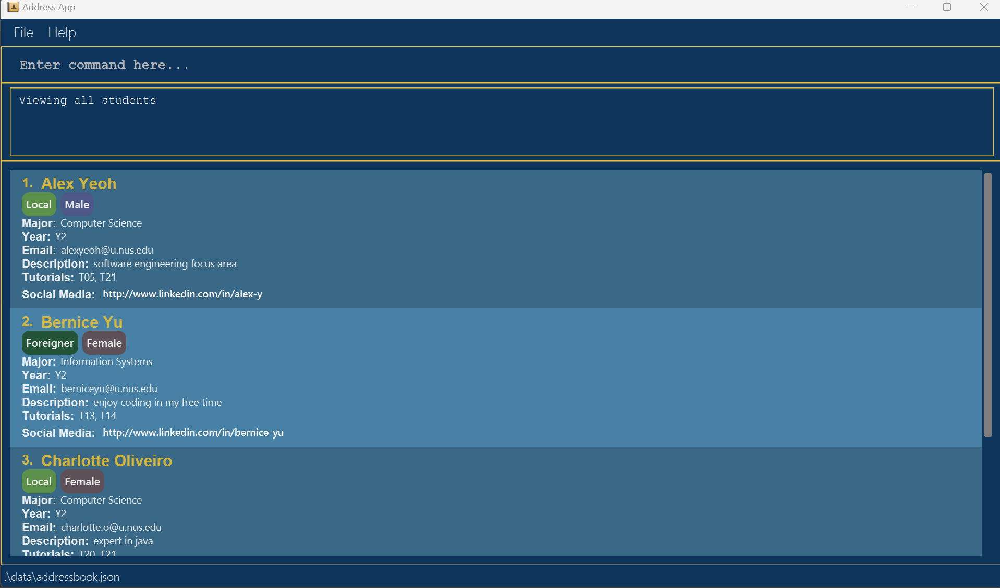

5. Type the command in the command box and press Enter to execute it. e.g. typing **`help`** and pressing Enter will open the help window. 
   Some example commands you can try:

    * `list` : Lists all students.

    * `add n/John Doe m/Computer Science y/2 e/johnd@u.nus.edu d/I love programming in my free time t/02 17 20 sm/https://www.linkedin.com/in/john-doe-123456789 nt/local g/m` : Adds a student named `John Doe` to the StudentConnect system.

    * `delete [email]` : Deletes the student with the corresponding email.

    * `clear` : Deletes all students.

    * `exit` : Exits the app.

    * `create` : Creates a new group.

6. Refer to the [Features](#features) below for details of each command.

--------------------------------------------------------------------------------------------------------------------

## Features

**:information_source: Notes about the command format:** 

* Words in `UPPER_CASE` are the parameters to be supplied by the user. 
  e.g. in `add n/NAME`, `NAME` is a parameter which can be used as `add n/John Doe`.

* Items in square brackets are optional. 
  e.g. `n/NAME [t/TUTORIALS]` can be used as `n/John Doe t/02` or as `n/John Doe`.

* Items with `…`​ after them can be used multiple times including zero times. 
  e.g. `[t/TAG]…​` can be used as ` ` (i.e. 0 times), `t/friend`, `t/friend t/family` etc.

* Parameters can be in any order. 
  e.g. if the command specifies `n/NAME m/MAJOR`, `m/MAJOR n/NAME` is also acceptable.

* Extraneous parameters for commands that do not take in parameters (such as `help`, `list`, `exit` and `clear`) will be ignored. 
  e.g. if the command specifies `list 123`, it will be interpreted as `list`.

* If you are using a PDF version of this document, be careful when copying and pasting commands that span multiple lines as space characters surrounding line-breaks may be omitted when copied over to the application.

### Viewing help : `help`

Shows a message explaining how to access the help page in the user guide and a button to copy the link. 
Provides the requirements for forming a group.

#### Format: `help`

#### Expected Output:
* GUI: Help window opened with help message, copy button and requirement message.
* Message: “Opened help window.”

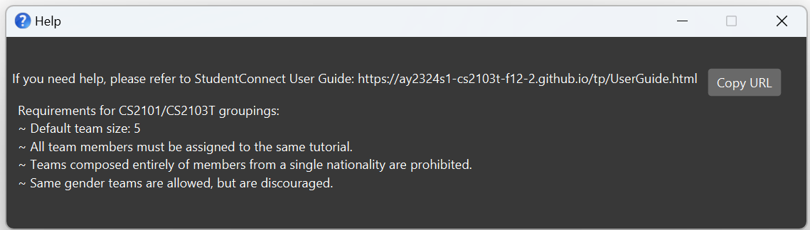

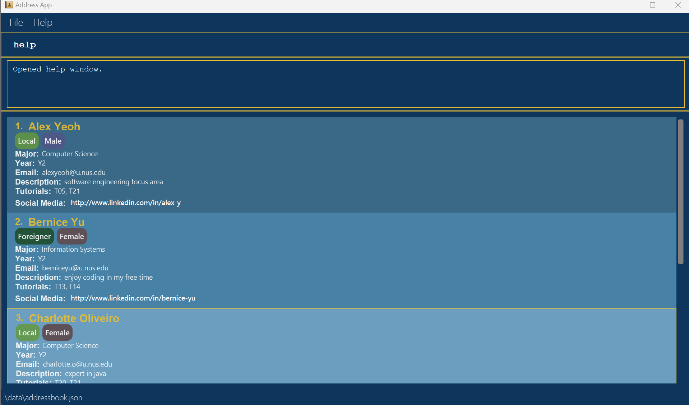

### Adding a student : `add`

Adds a student to the system.

#### Format: `add n/NAME m/MAJOR y/YEAR e/EMAIL d/DESCRIPTION t/TUTORIALS sm/SOCIALMEDIA nt/NATIONALITY g/GENDER`

:bulb: **Tip:**
A student can include multiple tutorial groups they are interested in

:bulb: **Tip:**
A student can have any number of social media links (including 0)

#### Examples:
* `add n/John Doe m/Computer Science y/2 e/johnd@u.nus.edu d/I’m a Frontend Developer t/06 19 sm/https://www.linkedin.com/in/john-doe-123456789 nt/local g/m`
* `add n/Betsy Crowe m/Computer Science y/2 e/betsycrowe@u.nus.edu  d/I’m adept at Backend technologies t/05 sm/ nt/foreigner g/f`

#### Acceptable Values:
* Name: Full names with alphabetical characters
* Major: Valid major names at NUS
* Year: Numeric year level
* Email: Valid email address ending in “@u.nus.edu”
* Description: Maximum 150 characters
* Tutorials: Two digit integers between 01 and 22 inclusive, each seperated by a space
* Social Media Link: Valid URL format to social media account (optional to include). Multiple URLs can be added by using `sm/` repeatedly.
* Nationality: Either 'local' or 'foreigner'
* Gender: A single character, either 'm' or 'f'

#### Expected Output (Success):
* GUI: New student entry added in the main student list
* Message: “Details added successfully! New student added: (details of new student)”
* Social Media Link can be clicked
* The link will be opened on a browser upon clicking

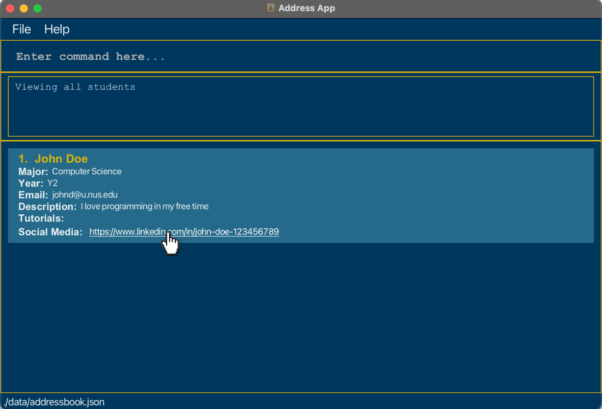

 Output with single social media link

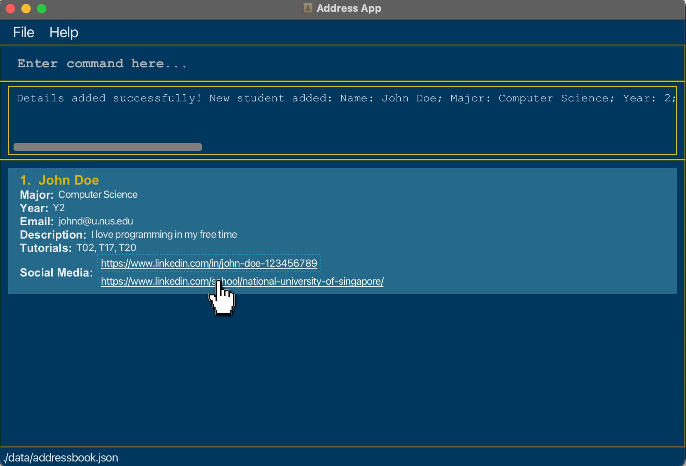
Output with multiple social media links

#### Expected Output (Failure):
* Message:  "Invalid command format! add: Adds a person to StudentConnect.  
Parameters: n/NAME m/MAJOR y/YEAR e/EMAIL d/DESCRIPTION t/TUTORIALS sm/SOCIAL_MEDIA_LINK nt/NATIONALITY g/GENDER 
Example: add n/John Doe m/Computer Science y/2 e/johnd@u.nus.edu d/I love programming in my free time 
t/02 17 20 sm/https://www.linkedin.com/in/john-doe-123456789 nt/local g/m";

#### Add feature output (Success):  
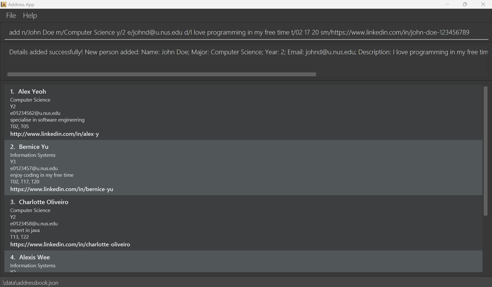

### Listing all students : `list`

Shows a list of all students in the system.

#### Format: `list`

#### Expected Output (Success):
* GUI: List of all student entries in the system
* Message: “Viewing all students”

#### Expected Output (Failure):
* Message: “Error: Unable to retrieve student entries. Please try again.”

### Editing a person : `edit`

Edits an existing student in the system.

#### Format: `edit EMAIL [n/NAME] [m/MAJOR] [y/YEAR] [e/EMAIL] [d/DESCRIPTION] [t/TUTORIALS] [sm/SOCIALMEDIA] [nt/NATIONALITY] [g/GENDER]…​`

* Edits the student with the specified EMAIL.
* At least one of the optional fields must be provided.
* Existing values will be updated to the input values.
* When editing tutorials, the existing tutorials of the student will be removed i.e. adding of tutorials is not cumulative.
* When editing social media, the existing social media of the student will be removed i.e. adding of social media is not cumulative.
* You can remove all the student's social media by typing `sm/` without
  specifying any social media after it.

#### Examples:
*  `edit johnd@u.nus.edu y/3 e/johndoe@u.nus.edu` Edits the year and email address of the student with the email `johnd@u.nus.edu` to be `3` and `johndoe@u.nus.edu` respectively.
*  `edit betsycrowe@u.nus.edu n/Betsy Crower sm/` Edits the name of the student with the email `betsycrowe@u.nus.edu` to be `Betsy Crower` and clears all existing social media.

#### Acceptable Values:
* EMAIL: a previously registered email address ending in “@u.nus.edu”

#### Expected Output (Success):
* GUI: Student details updated in the student list.
* Message: “Details updated successfully!”

#### Expected Output (Failure):
* Message: “Error: Email not found.”
* Message: “Error: None of the optional fields provided. Give at least one.”

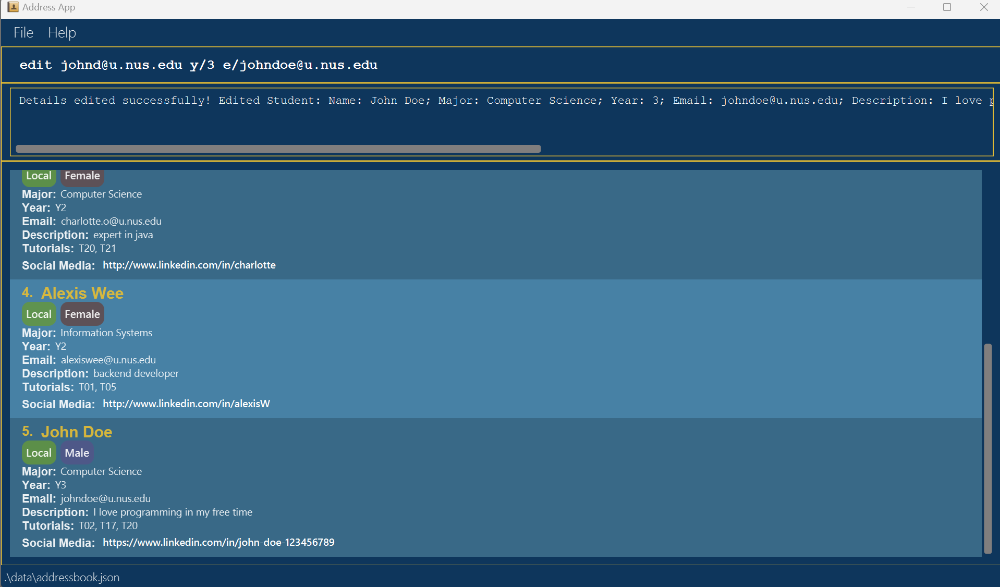

### Finding a student by name : `find`

Finds student(s) whose name(s) contain any of the given keywords.

#### Format: `find KEYWORD [MORE_KEYWORDS]`

* The search is case-insensitive. e.g. `john` will match `John`
* The order of the keywords does not matter. e.g. `John Doe` will match `Doe John`
* Only the name is searched.
* Partial words can be matched. e.g. `John` will match `Johnny`
* Students matching at least one keyword will be returned (i.e. `OR` search).
  e.g. `John Crowe` will return `John Doe`, `Betsy Crowe`

#### Examples:
* `find John` returns `john`, `John Doe` and `Johnny Wee`
* `find john betsy` returns `John Doe`, `Betsy Crowe` 

#### Expected Output (Success):
* GUI: List of all student entries whose name(s) match the keyword(s) in the system

#### Expected Output (Failure):
* Message: “Error: No keyword(s) provided.”
  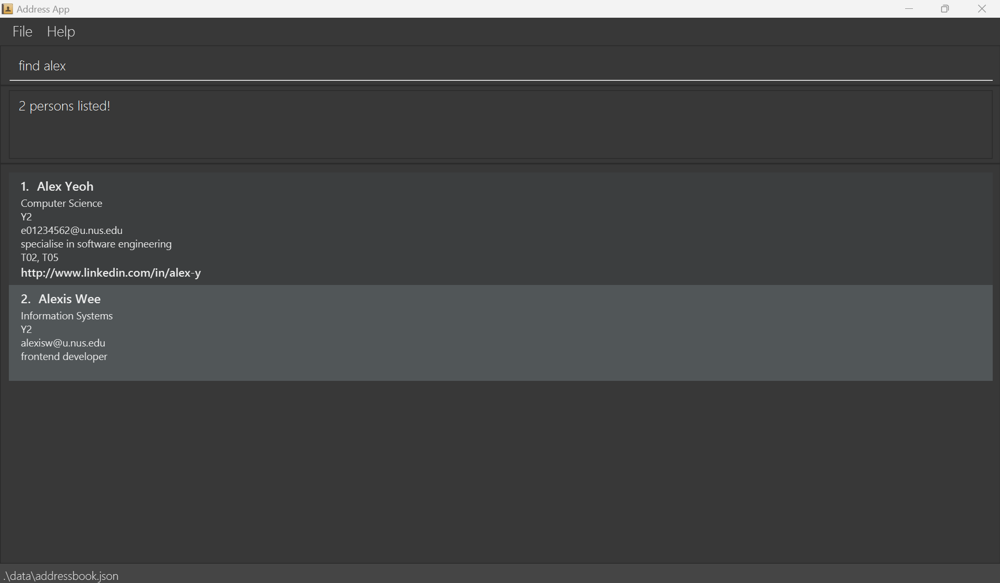

### Filtering students by tutorial : `filter`

Filters students by tutorial based on the given slots.

#### Format: `filter SLOT [MORE SLOTS]`

* The slots must be 2-digit numbers between 01 and 22 inclusive.
* The order of the slots does not matter. e.g. `08 15` will match `15 08`
* Only the tutorial is searched.
* Students matching at least one tutorial slot will be returned (i.e. `OR` search). e.g. `03 12` will return `03 16`, `04 12`

#### Examples:
* `filter 10` returns `10`, `06 10` and `10 18`
* `filter 12 16` returns `05 12`, `16 22`

#### Expected Output(Success):
* GUI: List of all student entries whose tutorial(s) match the slot(s) in the system

#### Expected Output (Failure):
* Message: “Error: No slot(s) provided.”

### Deleting a person : `delete`

Deletes a specific student and all personal details based on email.

#### Format: `delete EMAIL`

* Deletes the person with the specified `EMAIL`.
* The index refers to the email number shown in the displayed person list.
* The email must be registered in the system.

#### Examples:
* `list` followed by `delete alexy@u.nus.edu` deletes Alex Yeo from the system.

#### Acceptable Values:
* EMAIL: a previously registered email address ending in `u.nus.edu`

#### Expected Output(Success):
* GUI: Student details removed from student list.
* Message: `Person deleted successfully!`
  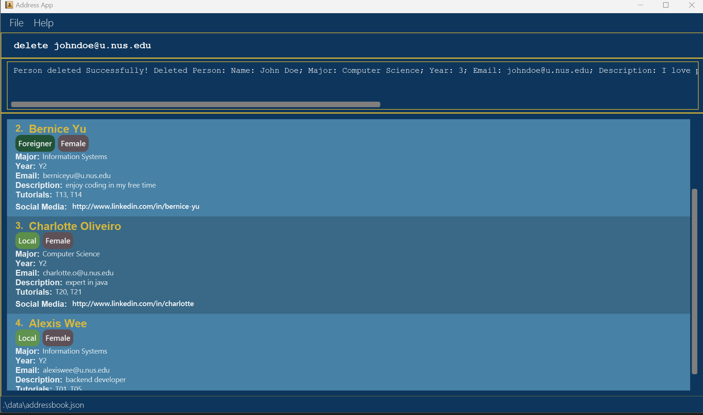

#### Expected Output (Failure):
* Message: `Error! Email not found!`

### Clearing all entries : `clear`

Clears all entries from the system.

#### Format: `clear`

#### Expected Output(Success):
* GUI: All students' details are removed from student list.
* Message: `All student data has been cleared`
  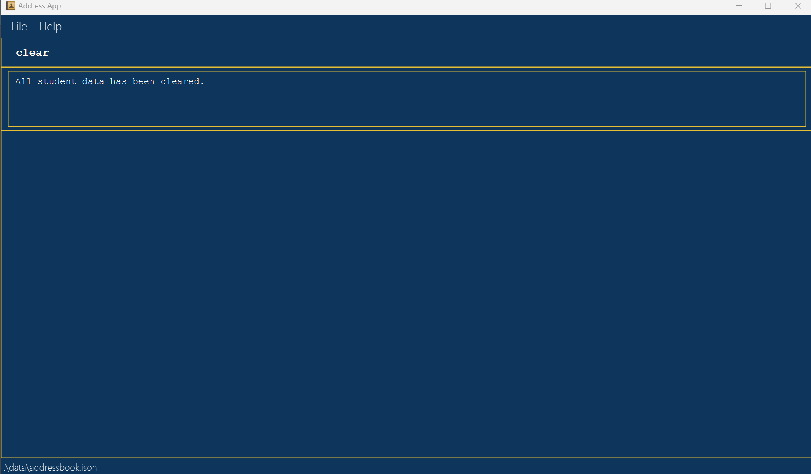

### Creating a new group : `create`

Creates a new empty group. The group number is automatically assigned and is used to uniquely identify the group.

Format: `create`

Expected Output(Success):
* GUI: A new empty group, with a group number, is created.
* Message: `Group created successfully! Group number is (number of newly created group)`

Expected Output(Failure):
* Message: `Error: Failed to create group.`

### Marking a task as done : `mark`

Mark a task for a specified group as done.

#### Format: `mark gr/[GROUP_NUMBER] ti/[TASK_INDEX]`

* Marks the task of the specified group as done.

#### Examples:
*  `mark gr/2 ti/1` Marks task 1 of group 2 as done.
*  `mark ti/2 gr/12` Marks task 2 of group 12 as done.

#### Acceptable Values:
* GROUP_NUMBER: Must be an integer value that is grater than 0 and a group number that is found in the group list.
* TASK_INDEX: Must be an integer value that is greater than 0 and smaller than task size.

#### Expected Output (Success):
* GUI: The task in the specified group is marked as done and task list is updated.
* Message: “Marked task number (ti) for group (gr) [and displays the updated task list]"

#### Expected Output (Failure):
* Message: “Invalid command format! mark: Mark task specified as done. Parameters: gr/[GROUP NUMBER] ti/[TASK INDEX] Example: mark gr/2 ti/3”
* Message: “Group with the provided group number not found.”
* Message: “Group number is not a non-zero unsigned integer.”
* Message: “Task index must be a positive integer.”
* Message: “Invalid task index. Task not found.”

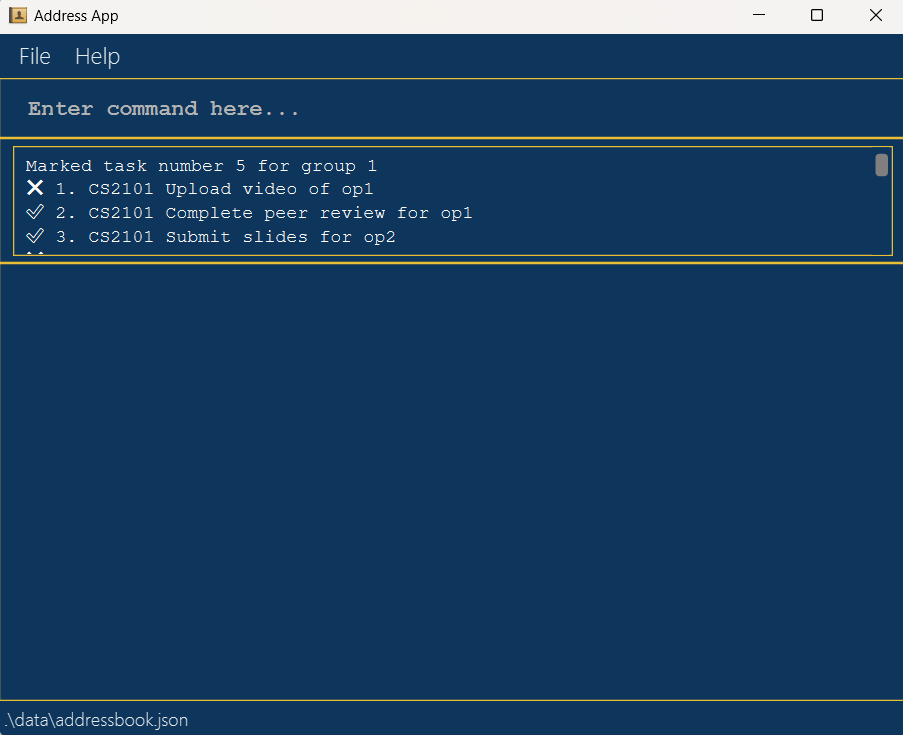

### Marking a task as not done : `unmark`

Mark a task for a specified group as not done.

#### Format: `unmark gr/[GROUP_NUMBER] ti/[TASK_INDEX]`

* Marks the task of the specified group as not done.

#### Examples:
*  `unmark gr/7 ti/3` Marks task 3 of group 7 as not done.
*  `unmark ti/5 gr/9` Marks task 5 of group 9 as not done.

#### Acceptable Values:
* GROUP_NUMBER: Must be an integer value that is grater than 0 and a group number that is found in the group list.
* TASK_INDEX: Must be an integer value that is greater than 0 and smaller than task size.

#### Expected Output (Success):
* GUI: The task in the specified group is marked as not done and task list is updated.
* Message: “Unmarked task number (ti) for group (gr) [and displays the updated task list]"

#### Expected Output (Failure):
* Message: “Invalid command format! unmark: Mark task specified as not done. Parameters: gr/[GROUP NUMBER] ti/[TASK INDEX] Example: unmark gr/2 ti/3”
* Message: “Group with the provided group number not found.”
* Message: “Group number is not a non-zero unsigned integer.”
* Message: “Task index must be a positive integer.”
* Message: “Invalid task index. Task not found.”

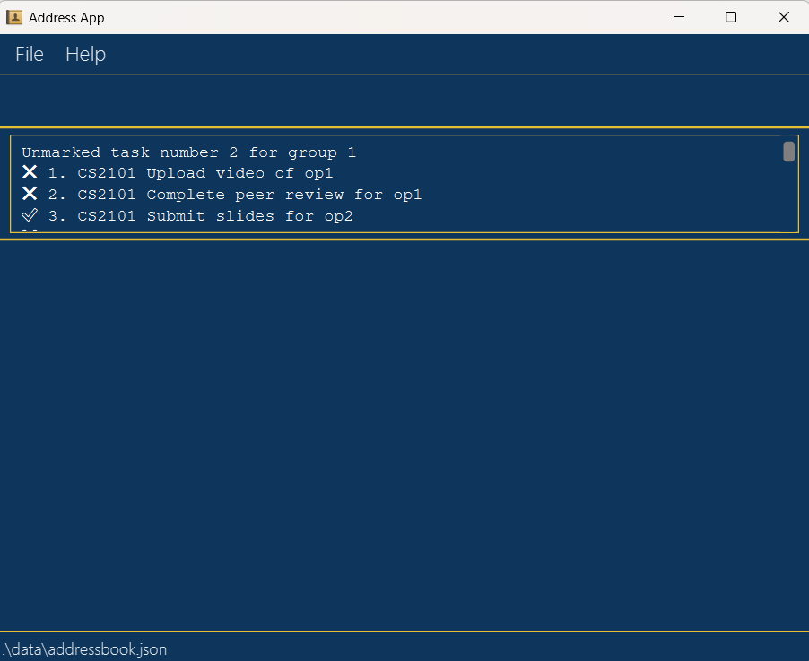

### Exiting the program : `exit`

Exits the program.

#### Format: `exit`

#### Expected Output(Success):
* GUI: Application window closes.
* Message (before closing): `Thank you for using StudentConnect! Exiting the application now…`

#### Expected Output(Failure):
* Message: `Error: Exiting the program failed.`

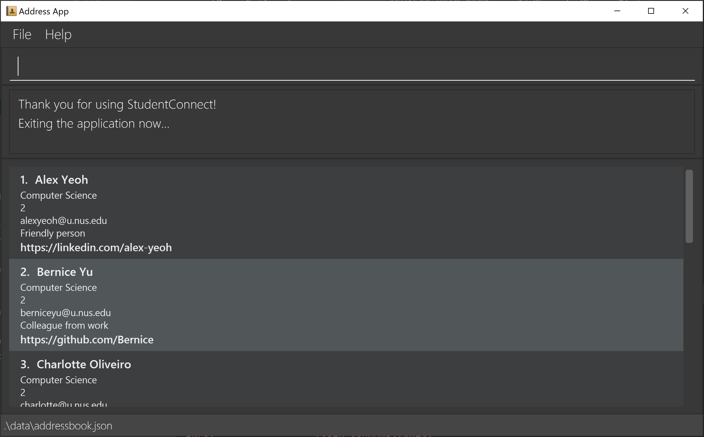

### Saving the data

Students' data are saved in the hard disk automatically after any command that changes the data. There is no need to save manually.

### Editing the data file

Students' data are saved automatically as a JSON file `[JAR file location]/data/addressbook.json`. Advanced users are welcome to update data directly by editing that data file.

:exclamation: **Caution:**
If your changes to the data file makes its format invalid, StudentConnect will discard all data and start with an empty data file at the next run. Hence, it is recommended to take a backup of the file before editing it.

### Archiving data files `[coming in v2.0]`

_Details coming soon ..._

--------------------------------------------------------------------------------------------------------------------

## FAQ

**Q**: How do I transfer my data to another Computer? 
**A**: Install the app in the other computer and overwrite the empty data file it creates with the file that contains the data of your previous StudentConnect home folder.

--------------------------------------------------------------------------------------------------------------------

## Known issues

1. **When using multiple screens**, if you move the application to a secondary screen, and later switch to using only the primary screen, the GUI will open off-screen. The remedy is to delete the `preferences.json` file created by the application before running the application again.

--------------------------------------------------------------------------------------------------------------------

## Command summary

| Action           | Format, Examples                                                                                                                                                                                                                        |
|------------------|-----------------------------------------------------------------------------------------------------------------------------------------------------------------------------------------------------------------------------------------|
| **Add**          | `add n/NAME m/MAJOR y/YEAR e/EMAIL d/DESCRIPTION t/TUTORIALS sm/SOCIALMEDIA nt/NATIONALITY g/GENDER`   e.g., `add n/Betsy Crowe m/Computer Science y/2 e/betsycrowe@u.nus.edu t/05 d/I’m adept at Backend technologies nt/local g/f` |
| **Clear**        | `clear`                                                                                                                                                                                                                                 |
| **Delete**       | `delete EMAIL`  e.g., `delete betsycrowe@u.nus.edu`                                                                                                                                                                                  |
| **Edit**         | `edit INDEX [n/NAME] [m/MAJOR] [y/YEAR] [e/EMAIL] [d/DESCRIPTION] [t/TUTORIALS] [sm/SOCIALMEDIA] [nt/NATIONALITY] [g/GENDER]`   e.g.,`edit 2 n/James Lee e/jameslee@example.com`                                                     |
| **Find**         | `find KEYWORD [MORE_KEYWORDS]`  e.g., `find James Jake`                                                                                                                                                                              |
| **List**         | `list`                                                                                                                                                                                                                                  |
| **Filter**       | `filter SLOT [MORE_SLOTS]`  e.g., `find 05 11`                                                                                                                                                                                       |
| **Create group** | `create`                                                                                                                                                                                                                                |
| **Mark**         | `mark gr/GROUP_NUMBER ti/TASK_INDEX`  e.g., `mark gr/2 ti/1`                                                                                                                                                                         |
| **Unmark**       | `unmark gr/GROUP_NUMBER ti/TASK_INDEX`  e.g., `unmark gr/5 ti/1`                                                                                                                                                                     |
| **Exit**         | `exit`                                                                                                                                                                                                                                  |
| **Help**         | `help`                                                                                                                                                                                                                                  |

