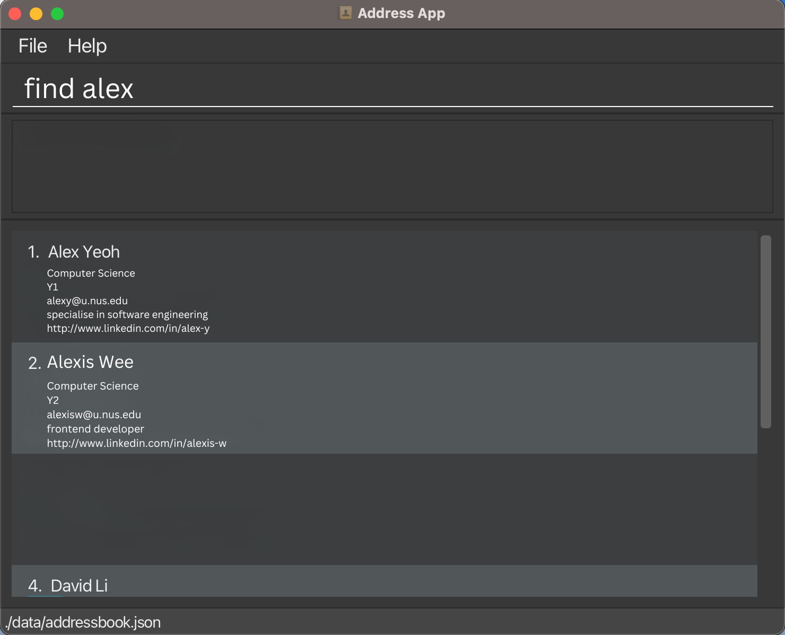

StudentConnect is a solution for hassle-free team formation for students to browse profiles and connect with others for the CS2103T and CS2101 group project.

## Table of Contents

---

1. [How to Use This Guide](#how-to-use-this-guide)
2. [Quick start](#quick-start)
3. [Features](#features)
    1. [General Commands](#general-commands)
        1. [Viewing help : `help`](#viewing-help--help)
        2. [Clearing all entries : `clear`](#clearing-all-entries--clear)
        3. [Exiting the program : `exit`](#exiting-the-program--exit)
    2. [Student Commands](#student-commands)
        1. [Adding a student : `add`](#adding-a-student--add)
        2. [Listing all students : `list`](#listing-all-students--list)
        3. [Editing a student : `edit`](#editing-a-student--edit)
        4. [Finding a student by name : `find`](#finding-a-student-by-name--find)
        5. [Filtering students by tutorial : `filter`](#filtering-students-by-tutorial--filter)
        6. [Deleting a student : `delete`](#deleting-a-student--delete)
    3. [Group Commands](#group-commands)
        1. [Creating a new group : `create`](#creating-a-new-group--create)
        2. [Listing all groups : `listGroup`](#listing-all-groups--listgroup)
        3. [Joining a group : `join`](#joining-a-group--join)
        4. [Deleting a group : `deleteGroup`](#deleting-a-group--deletegroup)
        5. [Leaving a group : `leave`](#leaving-a-specific-group--leave)
        6. [Finding a group by group number : `findGroup`](#finding-a-group-by-group-number--findgroup)
        7. [Filtering groups by tutorial : `filterGroup`](#filtering-groups-by-tutorial--filtergroup)
        8. [Checking a group : `checkGroup`](#checking-a-group--checkgroup)
        9. [List tasks : `tasks`](#listing-all-tasks-for-a-specific-group--tasks)
        10. [Marking a task as done : `mark`](#marking-a-task-as-done--mark)
        11. [Marking a task as not done : `unmark`](#marking-a-task-as-not-done--unmark)
4. [Saving the data](#saving-the-data)
5. [Editing the data file](#editing-the-data-file)
6. [Archiving data files [coming in v2.0]](#archiving-data-files-coming-in-v20)
7. [FAQ](#faq)
8. [Known issues](#known-issues)
9. [Command summary](#command-summary)
10. [Appendix](#appendix)
11. [Glossary](#glossary)

--------------------------------------------------------------------------------------------------------------------
## How to Use This Guide

This guide is designed to help you navigate the features of StudentConnect with ease. 

1. To assist you in understanding and using this manual effectively, we've included a symbol table that outlines the icons and notations you'll encounter throughout the document.

| Symbol               | Type        | Description                                                                                                                             |
|----------------------|-------------|-----------------------------------------------------------------------------------------------------------------------------------------|
| :information_source: | Information | This icon indicates additional information or context that can help you understand the features or requirements better.                 |
| :bulb:               | Tip         | Look for this symbol when you need helpful suggestions on using StudentConnect features more efficiently.                               |
| :exclamation:        | Important   | This symbol alerts you to critical information or essential functionality within StudentConnect that you should pay close attention to. |

2. Throughout this guide, we've provided screenshots that illustrate the expected output for each command and feature. This visual aid is designed to enhance your understanding and ensure that you can confidently anticipate the results of your actions. Below is a detailed overview of the various interface components that you'll become familiar with.

  
  
Figure 1: Student List View of StudentConnect

  
  
Figure 2: Group List View of StudentConnect

- **Command Box**: This is where you can enter any command for execution. After typing your command, press Enter to submit. If there is a syntax error or the command is unrecognisable, the text will turn red, prompting you to correct the command according to the specified requirements before pressing Enter again.
- **Feedback Box**: The feedback box is the area where the application communicates responses to your commands. It displays the correct command format if there is an input error, error messages when a command fails to execute, and the outcomes for commands like the `tasks` command.
- **Student List**: The student list panel displays a roster of all students and their associated details. Executing any student-related command will result in this panel being updated to show the relevant student list.
- **Group List**: Similar to the student list, the group list panel shows all existing groups along with their members and designated tutorials. Group-related commands will update this panel accordingly.
- **Menu Options**: The menu options provide quick access to general tasks within the application.

:exclamation: **Important:**
To guarantee that all your changes and data are saved correctly, it is strongly advised to type the `exit` command into the Command Box
instead of selecting `exit` from the menu options or closing the application window directly.
This practice helps prevent data loss and ensures a proper shutdown of the application.

3. Should you encounter any terminology within the guide that is unfamiliar, you can consult the [glossary](#glossary) section below. It provides clear definitions and explanations to help you grasp the specialized language used throughout this guide.
4. For any inquiries, the [FAQ](#faq) section is a good place to look for answers. In case your question is not addressed there, do not hesitate to submit an issue [here](https://github.com/AY2324S1-CS2103T-F12-2/tp/issues) for further assistance.
5. The [appendix](#appendix) section is included to detail all possible input values for fields that have specific constraints or require particular formats. This reference can help ensure that you input data correctly and understand the limitations of each field.
6. For a quick and compact overview of all the commands that StudentConnect offers, refer to the [command summary](#command-summary). This section servers as a handy reference for all possible actions you can perform within the application, laid out in an easily digestible format.

--------------------------------------------------------------------------------------------------------------------

## Quick start

1. Ensure you have Java `11` or above installed in your Computer.

2. Download the latest `studentconnect.jar` from [here](https://github.com/AY2324S1-CS2103T-F12-2/tp/releases).

3. Copy the file to the folder you want to use as the _home folder_ for your StudentConnect.

4. Open a command terminal, `cd` into the folder you put the jar file in, and use the `java -jar studentconnect.jar` command to run the application. 
   A GUI similar to the below should appear in a few seconds. Note how the app contains some sample data. 
   

5. Type the command in the command box and press Enter to execute it. e.g. typing **`help`** and pressing Enter will open the help window. 
   Some example commands you can try:

    * `list` : 
        * Lists all students in the StudentConnect system.
    * `add n/John Doe m/Computer Science y/2 e/johnd@u.nus.edu d/I love programming in my free time t/02 t/17 t/20 sm/https://www.linkedin.com/in/john-doe-123456789 nt/local g/m` : 
        * Adds a student named `John Doe` and his details to the StudentConnect system.
    * `delete EMAIL` : 
        * Deletes the student with the corresponding email.
    * `clear` : 
        * Deletes all data from the system (i.e. students, groups, and tasks).
    * `exit` : 
        * Exits the app.
    * `create t/03` : 
        * Creates a new group assigned to tutorial 3.

6. Refer to the [Features](#features) below for details of each command.

--------------------------------------------------------------------------------------------------------------------

## Features

**:information_source: Notes about the command format:** 

* Words in `UPPER_CASE` are the parameters to be supplied by the user. 
  e.g. in `add n/NAME`, `NAME` is a parameter which can be used as `add n/John Doe`.

* Items in square brackets are optional. 
  e.g. `n/NAME [t/TUTORIALS]` can be used as `n/John Doe t/02` or as `n/John Doe`.

* Items with `…`​ after them can be used multiple times including zero times. 
  e.g. `[t/TUTORIALS]…​` can be used as ` ` (i.e. 0 times), `t/03`, `t/11 t/20` etc.

* Parameters can be in any order. 
  e.g. if the command specifies `n/NAME m/MAJOR`, `m/MAJOR n/NAME` is also acceptable.

* Extraneous parameters for commands that do not take in parameters (such as `help`, `list`, `exit` and `clear`) will be ignored. 
  e.g. if the command specifies `list 123`, it will be interpreted as `list`.

* Commands must be in lower case.   e.g. `list` is a valid command, but `LIST` is not.

* If you are using a PDF version of this document, be careful when copying and pasting commands that span multiple lines as space characters surrounding line-breaks may be omitted when copied over to the application.

## General Commands

### Viewing help : `help`

Shows a message explaining how to access the help page in the user guide and a button to copy the link. 
Provides a list of requirements for forming a group in CS2103T/CS2101.

#### Format: `help`

#### Expected Output:
* GUI: Help window opened with help message, copy button and requirement message.
* Message: `Opened help window.`

### Clearing all entries : `clear`

Clears all entries from the system upon confirmation in the pop-up.

#### Format: `clear`
* Confirmation Pop-up opened.
* * Message: `Opened confirmation window. Please ensure you use the exit command when exiting StudentConnect for successful reset.`

#### Expected Output(Success):
* GUI: All students' details are removed from the student list. 
  
  

#### Expected Output(Failure or Cancellation):
* Case: Clear command fails.
* Case: You press `cancel` on the confirmation pop-up.
  GUI: All students' details remain on the student list.
  

### Exiting the program : `exit`

Exits the program.

#### Format: `exit`

#### Expected Output(Success):
* GUI: Application window closes.
* Message (before closing): `Thank you for using StudentConnect! Exiting the application now…` 

#### Expected Output(Failure):
* Message: `Error: Exiting the program failed.`

## Student Commands

### Adding a student : `add`

Adds a student to the system.

#### Format: `add n/NAME m/MAJOR y/YEAR e/EMAIL d/DESCRIPTION [t/TUTORIALS]… [sm/SOCIALMEDIA]… nt/NATIONALITY g/GENDER`

:bulb: **Tip:**
Including social media links and tutorial groups are optional.

:bulb: **Tip:**
A student can include multiple tutorial groups they are interested in. Add multiple tutorial groups by using `t/` repeatedly.

:bulb: **Tip:**
A student can have any number of social media links. Add multiple social media links by using `sm/` repeatedly.

#### Examples:
* `add n/John Doe m/Computer Science y/2 e/johnd@u.nus.edu d/I’m a Frontend Developer t/06 t/19 sm/https://www.linkedin.com/in/john-doe-123456789 nt/local g/m`
* `add n/Betsy Crowe m/Computer Science y/2 e/betsycrowe@u.nus.edu d/I’m adept at Backend technologies t/05 nt/foreigner g/f`

#### Acceptable Values:
* Name: Full names with alphabetical characters. Maximum 30 characters.
* Major: Valid major names at NUS. View the [appendix](#valid-majors) for more information.
* Year: Numeric year level. Accept values between `1` and `6` inclusive.
* Email: Valid email address ending in `@u.nus.edu`. Maximum 20 characters.
* Description: Maximum 150 characters.
* Tutorials: Two digit integers between `01` and `22` inclusive. Multiple tutorial slots can be added by using `t/` repeatedly.
* Social Media Link: Valid URL format to social media account. It must start with `https://`. Multiple URLs can be added by using `sm/` repeatedly.
* Nationality: Either `local` or `foreigner`.
* Gender: A single character, either `m` or `f`.

#### Expected Output (Success):
* GUI: New student entry added in the main student list.
* Message: `Details added successfully! New student added: (details of new student).` 

Note: 
* Social media links can be clicked.
* The link will be opened on a browser upon clicking.

Output with a single social media link

Output with multiple social media links

#### Expected Output (Failure):
* Case: Invalid command format, e.g. `add`, `add 1`, etc.
Message: `Invalid command format! add: Adds a student to StudentConnect.` 
  `Parameters: n/NAME m/MAJOR y/YEAR e/EMAIL d/DESCRIPTION [t/TUTORIALS]... [sm/SOCIAL_MEDIA_LINK]... nt/NATIONALITY g/GENDER` 
  `Example: add n/John Doe m/Computer Science y/2 e/johnd@u.nus.edu d/I love programming in my free time` 
  `t/02 sm/https://www.linkedin.com/in/john-doe-123456789 nt/local g/M;`

### Listing all students : `list`

Shows a list of all students in the system.

#### Format: `list`

#### Expected Output (Success):
* GUI: List of all student entries in the system
* Message: `Viewing all students` 
  

#### Expected Output (Failure):
* Message: `Error: Unable to retrieve student entries. Please try again.`

### Editing a student : `edit`

Edits an existing student in the system.

#### Format: `edit EMAIL [n/NAME] [m/MAJOR] [y/YEAR] [e/EMAIL] [d/DESCRIPTION] [t/TUTORIALS]…​ [sm/SOCIALMEDIA]…​ [nt/NATIONALITY] [g/GENDER]`

* Edits the student with the specified EMAIL.
* At least one of the optional fields must be provided.
* Existing values will be updated to the input values.
* When editing tutorials, the existing tutorials of the student will be removed i.e. adding of tutorials is not cumulative.
* When editing social media, the existing social media of the student will be removed i.e. adding of social media is not cumulative.
* You can remove all the student's social media by typing `sm/` without specifying any social media after it.

:bulb: **Tip:**
A student can edit to include multiple tutorial groups they are interested in. Add multiple tutorial groups by using `t/` repeatedly.

:bulb: **Tip:**
A student can edit to have any number of social media links. Add multiple social media links by using `sm/` repeatedly.

#### Examples:
*  `edit johnd@u.nus.edu y/3 e/johndoe@u.nus.edu` Edits the year and email address of the student with the email `johnd@u.nus.edu` to be `3` and `johndoe@u.nus.edu` respectively.
*  `edit betsycrowe@u.nus.edu n/Betsy Crower sm/` Edits the name of the student with the email `betsycrowe@u.nus.edu` to be `Betsy Crower` and clears all existing social media.

#### Acceptable Values:
* EMAIL: a previously registered email address ending in `@u.nus.edu`

#### Expected Output (Success):
* GUI: Student details updated in the student list.
* Message: `Details edited successfully! Edited Student: [Updated data]` 
  

#### Expected Output (Failure):
* Case: No fields provided for edit. 
Message: `At least one field to edit must be provided.`
* Case: Email not found in the system. 
Message: `Student with the provided email not found.`

### Finding a student by name : `find`

Finds student(s) whose name(s) contain any of the given keywords.

#### Format: `find KEYWORD [MORE_KEYWORDS]…​`

* The search is case-insensitive. e.g. `john` will match `John`
* The order of the keywords does not matter. e.g. `John Doe` will match `Doe John`
* Only the name is searched.
* Partial words can be matched. e.g. `John` will match `Johnny`
* Students matching at least one keyword will be returned (i.e. `OR` search). e.g. `John Crowe` will return `John Doe`, `Betsy Crowe`

#### Examples:
* `find John` returns `john`, `John Doe` and `Johnny Wee`.
* `find john betsy` returns `John Doe`, `Betsy Crowe`. 

#### Expected Output (Success):
* GUI: List of all student entries whose name(s) match the keyword(s) in the system. 
  

#### Expected Output (Failure):
* Case: Invalid command format, e.g. `find`.
Message: `Invalid command format!` 
  `find: Finds all students whose names contain any of the specified keywords (case-insensitive) and displays them as a list with index numbers.` 
  `Parameters: KEYWORD [MORE_KEYWORDS]...` 
  `Example: find alice bob charlie`

### Filtering students by tutorial : `filter`

Filters students by tutorial based on the given slots.

#### Format: `filter SLOT [MORE SLOTS]…​`

* The slots must be 2-digit numbers between `01` and `22` inclusive.
* Tutorials are only accepted as 2-digits, ie. `3` is not a valid tutorial, but `03` is.
* The order of the slots does not matter. e.g. `08 15` will match `15 08`.
* Only the tutorial is searched.
* Students matching at least one tutorial slot will be returned (i.e. `OR` search). e.g. `03 12` will return `03 16`, `04 12`.

#### Examples:
* `filter 10` returns students in `T10`, `T06 T10` and `T10 T18`.
* `filter 12 16` returns students in `T05 T12`, `T16 T22`.

#### Expected Output(Success):
* GUI: List of all student entries whose tutorial(s) match the slot(s) in the system. 
  

#### Expected Output (Failure):
* Case: Invalid command format, e.g. `filter`.
 Message: `Invalid command format!` 
  `filter: Filters all students whose tutorials match any of the specified slots (2-digit numbers between 01 and 22) and displays them as a list with index numbers.` 
  `Parameters: SLOT [MORE_SLOTS]...` 
  `Example: filter 08 15`
* Case: Invalid slot(s) is provided, e.g. `filter 25`, `filter 0`, etc.
 Message: "Tutorials should be 2-digit numbers between 01 and 22."

### Deleting a student : `delete`

Deletes a specific student and all personal details based on email.

#### Format: `delete EMAIL`

* Deletes the student with the specified `EMAIL`.
* The email must be registered in the system.

#### Examples:
* `list` followed by `delete alexy@u.nus.edu` deletes Alex Yeo from the system.

#### Acceptable Values:
* EMAIL: a previously registered email address ending in `u.nus.edu`

#### Expected Output(Success):
* GUI: Student details removed from student list.
* Message: `Student deleted successfully! [Deleted student's details]`
  

#### Expected Output (Failure):
* Case: Provided email not registered in system.
  Message: `Student with the provided email not found.`
* Case: Invalid command format e.g. `delete 02`.
  Message: `Invalid command format!` 
  `delete: Deletes the student identified by the email address.` 
  `Parameters: EMAIL` 
  `Example: delete alexyeoh@u.nus.edu`

## Group Commands

:exclamation: **Important:**
StudentConnect provides a set of group formation features to make it more convenient for students to find group mates. A group consists of 3 main components: a group number, a tutorial number and the group members.
  **Group number:** Used to uniquely identify the group.
  **Tutorial number:** This number is set by the creator of the group and serves as an indication of which tutorial class the members of the group are interested in enrolling in. It **does not** restrict students who do not have a matching tutorial number in their profile from joining the group. Running the [checkGroup](#checking-a-group--checkgroup) command displays a warning if there are members whose tutorial numbers do not match the group's tutorial number.
  **Group members:** The students who are members of this group.

### Creating a new group : `create`

Creates a new empty group with the given tutorial number. The group number is automatically assigned and is used to uniquely identify each group. The tutorial number serves as an indication of which tutorial class the members of the group are interested in enrolling in. This can provide information about the tutorial preferences of the group members, to other students who are looking for a group to join.

#### Format: `create t/TUTORIAL`

#### Expected Output(Success):
* GUI: A new empty group, with a group number, is created.
* Message: `Group created successfully! Group number is [GROUP_NUMBER]`
  

#### Expected Output(Failure):
* Case: Invalid command format, e.g. `create`, `create 02`, etc.
Message: `Invalid command format!`
  `create: Creates a new empty group.`
  `Parameters: t/TUTORIAL Example: create t/02`
* Case: Invalid tutorial number is provided, e.g. `create t/0`, `create t/25`, etc.
 Message: `Tutorials should be 2-digit numbers between 01 and 22.`

### Listing all groups : `listGroup`

Displays a list of all groups. For each group, the group number, and the names and emails of the members are shown.

#### Format: `listGroup`

#### Expected Output(Success):
* GUI: A list of all groups that are in the system is shown.
* Message: `Viewing all groups` 

#### Expected Output(Failure):
* Message: `Error: Unable to retrieve group entries. Please try again.`

### Deleting a group : `deleteGroup`

Deletes a group from the system, based on group number.

#### Format: `deleteGroup gr/GROUP_NUMBER`

#### Examples:
*  `deleteGroup gr/2` deletes Group 2 from the system.
*  `deleteGroup gr/5` deletes Group 5 from the system.

#### Acceptable Values:
* GROUP_NUMBER: Must be a non-zero unsigned integer.

#### Expected Output(Success):
* GUI: Specified group is no longer visible.
* Message: `Group deleted successfully! Deleted Group: [GROUP_NUMBER]`
  

#### Expected Output(Failure):
* Case: Group with specified number is not in the system.
  Message: `Group with the provided group number not found.`

### Joining a group : `join`

Adds a student to the specified group.

#### Format: `join e/EMAIL gr/GROUP_NUMBER`

#### Expected Output(Success):
* GUI: The student's name and email are displayed in the specified group's card.
* Message: `Join successful! [NAME] has joined Group [GROUP_NUMBER]!`

#### Expected Output(Failure):
* Case: Email not found in the system. 
Message: `Student with the provided email not found.`
* Case: Group number not found in the system. 
Message: `Group with the provided group number not found.`
* Case: Student has been added in the group already. 
Message: `The provided student is already a member of the provided group.`
* Case: Group has 5 members and is full.  
Message: `Join failed as the group already has 5 members.`
* Case: Student is found in another group already. 
Message: `The provided student is already in another group.`

### Leaving a specific group : `leave`

Deletes a member from a specific group, indicating that they have left.

#### Format: `leave e/EMAIL gr/GROUP_NUMBER`

* Removes student from specified group.

#### Examples:
*  `leave e/johnd@u.nus.edu gr/1` Removes member with email `johnd@u.nus.edu` from Group 1.
*  `leave e/bettyc@u.nus.edu gr/11` Removes member with email `bettyc@u.nus.edu` from Group 11.

#### Acceptable Values:
* GROUP_NUMBER: Must be a non-zero unsigned integer.
* EMAIL: Must be a valid NUS email registered in the system.

#### Expected Output (Success):
* GUI: Student details removed from specified group.
* Message: `Leave successful! NAME has left group 1!`

#### Expected Output (Failure):
* Case: Email not found in the system. 
Message: `Person with the provided email not found.`
* Case: Group number not found in the system. 
Message: `Group with the provided group number not found.`
* Case: Student is not a member of the provided group.  
Message: `The above student is not a member of the provided group.`

### Finding a group by group number : `findGroup`

Finds group(s) with group number(s) that matches any of the given keywords.

#### Format: `findGroup KEYWORD [MORE_KEYWORDS]`

* The order of the keywords does not matter. e.g. `5 12` will match `12 5`.
* Only the group number is searched.
* Only the full keywords will be matched. e.g. `1` will not match `12`.
* Groups matching one keyword will be returned (i.e. `OR` search). e.g. `5 12` will return `5`, `12`.
* The keyword(s) must be a non-zero unsigned integer.

#### Examples:
* `findGroup 7` returns Group `7`.
* `findGroup 7 15` returns Group `7`, Group `15`.

#### Expected Output (Success):
* GUI: List of all group entries whose group number(s) match the keyword(s) in the system. 
  

#### Expected Output (Failure):
* Case: Invalid command format is provided, e.g. `findGroup`.
 Message: `Invalid command format!` 
  `findGroup: Finds all groups whose number contain any of the specified keywords and displays them as a list with index numbers.` 
  `Parameters: KEYWORD [MORE_KEYWORDS]...` 
  `Example: findGroup 1 5 10`
* Case: Invalid keyword(s) is provided, e.g. `findGroup a`, `findGroup 0`, etc.
 Message: `Group number is not a non-zero unsigned integer.`

### Filtering groups by tutorial : `filterGroup`

Filters the groups by tutorial based on the given slot.

#### Format: `filterGroup SLOT`

* The slot must be 2-digit numbers between `01` and `22` inclusive.
* Tutorials are only accepted as 2-digits, ie. `3` is not a valid tutorial, but `03` is.
* Only the tutorial is searched.

#### Examples:
* `filterGroup 03` returns groups that belong to `T03`.

#### Expected Output(Success):
* GUI: List of all group entries with the tutorial that match the slot in the system.
  

#### Expected Output (Failure):
* Case: Invalid command format is provided, e.g. `filterGroup`.
Message: `Invalid command format!` 
  `filterGroup: Filters all groups that belong to the specified tutorial slot (2-digit numbers between 01 and 22) and displays them as a list with index numbers.` 
  `Parameters: SLOT` 
  `Example: filterGroup 01"`
* Case: Invalid slot is provided, e.g. `filterGroup 0`, `filterGroup 25`, etc.
Message: `Tutorials should be 2-digit numbers between 01 and 22.`

### Checking a group : `checkGroup`

Checks if a group fulfils the group requirements of the course.

#### Format: `checkGroup GR0UP_NUMBER`

* Checks the group with the specified `GROUP_NUMBER`.
* The group number must come from a group that has been created in the system.
* checkGroup does not restrict students from joining a group, instead, it provides helpful alerts to help groups adhere to the criteria set by CS2103T and CS2101.

#### Examples:
* `checkGroup 4` checks the group with a group number `4` if it is created in the system.

#### Expected Output(Success):
* Case: Group fulfils the group requirements. 
Message: `Group GROUP_NUMBER` 
  `Group fulfils the diversity requirements of CS2103T.` 
  
* Case: Group has no members. 
Message: `Group GROUP_NUMBER` 
  `Group does not have any members.` 
  `You can enter the help command for more information on group requirements.`
* Case: Group has only 1 member. 
Message: `Group GROUP_NUMBER` 
  `Group has only one member.` 
  `You can enter the help command for more information on group requirements.`
* Case: Group has more than 1 member and does not fulfil the group requirements. Possible messages include: 
Message: `Group GROUP_NUMBER` 
Message: `Group has less than 5 members.` 
Message: `Group size has exceeded limit with more than 5 members.` 
Message: `Group comprises of members of the same nationality.` 
Message: `Group comprises of members of the same gender.` 
Message: `Not every group member's tutorial matches the group's tutorial.` 
Message: `You can enter the help command for more information on group requirements.` 

#### Expected Output (Failure):
* Case: Invalid command format is provided, e.g. `checkGroup`.
Message: `Invalid command format!` 
  `checkGroup: Checks the group identified by its group number.` 
  `Parameters: GROUP_NUMBER"` 
  `Example: checkGroup 1`
* Case: Group not found in the system. 
Message: `Group with the provided group number not found.`

### Listing all tasks for a specific group : `tasks`

Lists out all tasks for a specific group.

#### Format: `tasks GROUP_NUMBER`

* Lists out all tasks for the specified group.

#### Examples:
*  `tasks 2` Lists out all tasks for group `2`.
*  `tasks 5` Lists out all tasks for group `5`.

#### Acceptable Values:
* GROUP_NUMBER: Must be a non-zero unsigned integer.

#### Expected Output (Success):
* GUI: List of all tasks for the specified group is displayed, the specified group and group members are shown.
* Message: `Here are the tasks for group [GROUP_NUMBER]: [list of tasks]`
  

#### Expected Output (Failure):
* Case: Invalid tasks command, e.g. `tasks gr/3`, `tasks t`, etc. 
  `Message: “Invalid command format!` 
  `tasks: Lists out all tasks for a specific group.` 
  `Parameters: GROUP_NUMBER` 
  `Example: tasks 3`
* Case: Invalid group number as the group has not yet been created
    * Message: `Group with the provided group number not found.`

### Marking a task as done : `mark`

Mark a task for a specified group as done.

#### Format: `mark gr/GROUP_NUMBER ti/TASK_INDEX`

* Marks the task of the specified group as done.

#### Examples:
*  `mark gr/2 ti/1` Marks task `1` of group `2` as done.
*  `mark ti/2 gr/12` Marks task `2` of group `12` as done.

#### Acceptable Values:
* GROUP_NUMBER: Must be an integer value that is grater than 0 and a group number that is found in the group list.
* TASK_INDEX: Must be an integer value that is greater than 0 and smaller than task size.

#### Expected Output (Success):
* GUI: The task in the specified group is marked as done and task list is updated.
* Message: `Marked task number (ti) for group (gr) [and displays the updated task list]`
  

#### Expected Output (Failure):
* Case: Invalid mark command, e.g. `mark`, `mark t`, etc. 
Message: `Invalid command format! mark: Mark task specified as done. Parameters: gr/GROUP_NUMBER ti/TASK_INDEX Example: mark gr/2 ti/3`
* Case: Invalid group number, a group number that is not found from the list in `listGroup` command. 
Message: `Group with the provided group number not found.`
* Case: Invalid group number, e.g. zero or negative numbers. 
Message: `Group number is not a non-zero unsigned integer.`
* Case: Invalid task index, e.g zero or negative numbers. 
Message: `Task index must be a positive integer.`
* Case: Invalid task index, e.g. task index greater than the number of tasks found from the list in `tasks` command. 
Message: `Invalid task index. Task not found.`

### Marking a task as not done : `unmark`

Mark a task for a specified group as not done.

#### Format: `unmark gr/GROUP_NUMBER ti/TASK_INDEX`

* Marks the task of the specified group as not done.

#### Examples:
*  `unmark gr/7 ti/3` Marks task `3` of group `7` as not done.
*  `unmark ti/5 gr/9` Marks task `5` of group `9` as not done.

#### Acceptable Values:
* GROUP_NUMBER: Must be an integer value that is grater than 0 and a group number that is found in the group list.
* TASK_INDEX: Must be an integer value that is greater than 0 and smaller than task size.

#### Expected Output (Success):
* GUI: The task in the specified group is marked as not done and task list is updated.
* Message: `Unmarked task number (ti) for group (gr) [and displays the updated task list]`
  

#### Expected Output (Failure):
* Case: Invalid unmark command, e.g. `unmark`, `unmark t`, etc. 
  Message: `Invalid command format! unmark: Mark task specified as not done. Parameters: gr/GROUP_NUMBER ti/TASK_INDEX Example: unmark gr/2 ti/3`
* Case: Invalid group number, a group number that is not found from the list in `listGroup` command. 
Message: `Group with the provided group number not found.`
* Case: Invalid group number, e.g. zero or negative numbers. 
Message: `Group number is not a non-zero unsigned integer.`
* Case: Invalid task index, e.g zero or negative numbers. 
Message: `Task index must be a positive integer.`
* Case: Invalid task index, e.g. task index greater than the number of tasks found from the list in `tasks` command. 
Message: `Invalid task index. Task not found.`

### Saving the data

Students' data are saved in the hard disk automatically after any command that changes the data. There is no need to save manually.

### Editing the data file

Students' data are saved automatically as a JSON file `[JAR file location]/data/addressbook.json`. Advanced users are welcome to update data directly by editing that data file.

:exclamation: **Caution:**
If your changes to the data file makes its format invalid, StudentConnect will discard all data and start with an empty data file at the next run. Hence, it is recommended to take a backup of the file before editing it.

### Archiving data files `[coming in v2.0]`

_Details coming soon ..._

--------------------------------------------------------------------------------------------------------------------

## FAQ

**Q**: How do I transfer my data to another Computer? 
**A**: Install the app in the other computer and overwrite the empty data file it creates with the file that contains the data of your previous StudentConnect home folder.

--------------------------------------------------------------------------------------------------------------------

## Known issues

1. **When using multiple screens**, if you move the application to a secondary screen, and later switch to using only the primary screen, the GUI will open off-screen. The remedy is to delete the `preferences.json` file created by the application before running the application again.
2. **Clear Command**, if you use the clear command, but exit the application incorrectly using the red exit button instead of running the exit command, data will not be cleared. Kindly always use the exit command to leave the application.

--------------------------------------------------------------------------------------------------------------------

## Command summary

| Action           | Format, Examples                                                                                                                                                                                                                                |
|------------------|-------------------------------------------------------------------------------------------------------------------------------------------------------------------------------------------------------------------------------------------------|
| **Help**         | `help`                                                                                                                                                                                                                                          |
| **Clear**        | `clear`                                                                                                                                                                                                                                         |
| **Exit**         | `exit`                                                                                                                                                                                                                                          |
| **Add**          | `add n/NAME m/MAJOR y/YEAR e/EMAIL d/DESCRIPTION [t/TUTORIALS]…​ [sm/SOCIALMEDIA]…​ nt/NATIONALITY g/GENDER`   e.g., `add n/Betsy Crowe m/Computer Science y/2 e/betsycrowe@u.nus.edu t/05 d/I’m adept at Backend technologies nt/local g/f` |
| **List**         | `list`                                                                                                                                                                                                                                          |
| **Edit**         | `edit EMAIL [n/NAME] [m/MAJOR] [y/YEAR] [e/EMAIL] [d/DESCRIPTION] [t/TUTORIALS]…​ [sm/SOCIALMEDIA]…​ [nt/NATIONALITY] [g/GENDER]`   e.g.,`edit jameslee@u.nus.edu n/James Lee e/jameslee@u.nus.edu`                                          |
| **Find**         | `find KEYWORD [MORE_KEYWORDS]…​`  e.g., `find James Jake`                                                                                                                                                                                    |
| **Filter**       | `filter SLOT [MORE_SLOTS]…​`  e.g., `filter 05 11`                                                                                                                                                                                           |
| **Delete**       | `delete EMAIL`  e.g., `delete betsycrowe@u.nus.edu`                                                                                                                                                                                          |
| **Create group** | `create t/[TUTORIAL]`   e.g., `create t/01`                                                                                                                                                                                                  |
| **List groups**  | `listGroup`                                                                                                                                                                                                                                     |
| **Delete group** | `deleteGroup gr/[GROUP_NUMBER}`   e.g., `deleteGroup gr/1`                                                                                                                                                                                   |
| **Join group**   | `join e/[EMAIL] gr/[GROUP_NUMBER]`   e.g., `join e/johnd@u.nus.edu gr/1`                                                                                                                                                                     |
| **Leave group**  | `leave e/[EMAIL] gr/[GROUP_NUMBER}`   e.g., `leave e/johnd@u.nus.edu gr/1`                                                                                                                                                                   |
| **Find group**   | `findGroup KEYWORD [MORE_KEYWORDS]`  e.g., `findGroup 7 15`                                                                                                                                                                                  |
| **Filter group** | `filter SLOT`   e.g., `filterGroup 3`                                                                                                                                                                                                        |
| **Check group**  | `checkGroup GR0UP_NUMBER`   e.g., `checkGroup 4`                                                                                                                                                                                             |
| **List Tasks**   | `tasks GROUP_NUMBER`  e.g., `tasks 5`                                                                                                                                                                                                        |
| **Mark**         | `mark gr/GROUP_NUMBER ti/TASK_INDEX`  e.g., `mark gr/2 ti/1`                                                                                                                                                                                 |
| **Unmark**       | `unmark gr/GROUP_NUMBER ti/TASK_INDEX`  e.g., `unmark gr/5 ti/1`                                                                                                                                                                             |

--------------------------------------------------------------------------------------------------------------------

## Appendix

### Valid Majors

:bulb: **Tip:**
If your major is not in the list below, you can simply write `Others` as your major.

:bulb: **Tip:**
If you have a double degree, double major or a major-minor, you are required to choose only one major. Please select any one of the majors listed below.

For now, we accept the following majors in National University of Singapore(NUS):

| Major                                     |
|-------------------------------------------|
| Accountancy                               |
| Actuarial Studies                         |
| Anthropology                              |
| Architecture                              |
| Biological Sciences                       |
| Biomedical Engineering                    |
| Business Administration                   |
| Business Administration (Accountancy)     |
| Business Analytics                        |
| Chemical Engineering                      |
| Chemistry                                 |
| Chinese Language                          |
| Chinese Studies                           |
| Communications and New Media              |
| Civil Engineering                         |
| Computer Engineering                      |
| Computer Science                          |
| Data Science and Analytics                |
| Data Science and Economics                |
| Dentistry                                 |
| Economics                                 |
| Electrical Engineering                    |
| English Language                          |
| English Literature                        |
| Environmental Engineering                 |
| Environmental Studies                     |
| Food Science and Technology               |
| Geography                                 |
| Global Studies                            |
| History                                   |
| Japanese Studies                          |
| Industrial Design                         |
| Industrial Engineering                    |
| Industrial and Systems Engineering        |
| Information Systems                       |
| Information Security                      |
| Infrastructure and Project Management     |
| Landscape Architecture                    |
| Law                                       |
| Life Sciences                             |
| Malay Studies                             |
| Management                                |
| Marketing                                 |
| Materials Science and Engineering         |
| Mathematics                               |
| Mechanical Engineering                    |
| Medicine                                  |
| Pharmaceutical Science                    |
| Philosophy                                |
| Philosophy, Politics, and Economics       |
| Physics                                   |
| Political Science                         |
| Psychology                                |
| Quantitative Finance                      |
| Real Estate                               |
| Social Work                               |
| Sociology                                 |
| South Asian Studies                       |
| Southeast Asian Studies                   |
| Statistics                                |
| Systems Engineering                       |
| Theatre Studies                           |
| Urban Studies                             |
| Visual Communications                     |

--------------------------------------------------------------------------------------------------------------------
## Glossary
